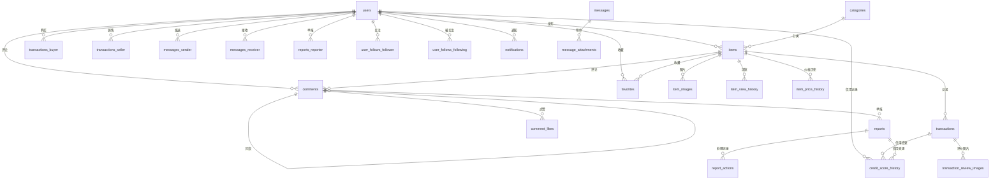

# 📊 数据库Schema完整说明

## 🎯 概述

校园交易系统采用**四数据库同步架构**，包含 **25张核心表**，通过严格的外键约束保证数据完整性和一致性。

---

## 📋 表结构总览

### 1️⃣ 核心业务表 (9张)

| 表名 | 说明 | 主要关联 |
|------|------|----------|
| `users` | 用户表 | 核心主表 |
| `categories` | 商品分类表 | 独立表 |
| `items` | 商品表 | → users, categories |
| `item_images` | 商品图片表 | → items |
| `comments` | 评论表 | → items, users, comments(自关联) |
| `transactions` | 交易表 | → items, users(buyer), users(seller) |
| `messages` | 消息表 | → users(sender), users(receiver), items |
| `favorites` | 收藏表 | → users, items |
| `reports` | 举报表 | → users(多个), items, comments |

### 2️⃣ 系统管理表 (3张)

| 表名 | 说明 | 主要关联 |
|------|------|----------|
| `audit_logs` | 审计日志表 | → users |
| `conflict_records` | 同步冲突表 | → users(resolved_by) |
| `system_configs` | 系统配置表 | 独立表 |

### 3️⃣ 扩展关联表 (13张)

| 表名 | 说明 | 主要关联 | 关系类型 |
|------|------|----------|----------|
| `user_follows` | 用户关注表 | → users(follower), users(following) | 多对多 |
| `item_view_history` | 浏览历史表 | → users, items | 多对多+时间序列 |
| `user_addresses` | 用户地址表 | → users | 一对多 |
| `item_price_history` | 价格历史表 | → items | 一对多+时间序列 |
| `comment_likes` | 评论点赞表 | → comments, users | 多对多 |
| `message_attachments` | 消息附件表 | → messages | 一对多 |
| `report_actions` | 举报处理记录表 | → reports, users(admin) | 一对多 |
| `transaction_review_images` | 交易评价图片表 | → transactions | 一对多 |
| `notifications` | 系统通知表 | → users | 一对多 |
| `search_history` | 搜索历史表 | → users, items | 时间序列 |
| `credit_score_history` | 信用分变更记录表 | → users, transactions, reports | 审计追踪 |
| `sync_tasks` | 同步任务表 | 独立表(系统级) | - |
| `performance_metrics` | 性能监控表 | 独立表(系统级) | - |

---

## 🔗 核心关系图

### 用户相关关系
```
users (用户表)
├── items (seller_id)                    - 一对多: 用户发布的商品
├── transactions (buyer_id)              - 一对多: 用户购买记录
├── transactions (seller_id)             - 一对多: 用户销售记录
├── comments (user_id)                   - 一对多: 用户评论
├── messages (sender_id)                 - 一对多: 发送的消息
├── messages (receiver_id)               - 一对多: 接收的消息
├── favorites (user_id)                  - 一对多: 用户收藏
├── reports (reporter_id)                - 一对多: 用户发起的举报
├── reports (reported_user_id)           - 一对多: 被举报记录
├── audit_logs (user_id)                 - 一对多: 操作审计
├── user_follows (follower_id)           - 多对多: 关注他人
├── user_follows (following_id)          - 多对多: 被关注
├── item_view_history (user_id)          - 一对多: 浏览历史
├── user_addresses (user_id)             - 一对多: 用户地址
├── comment_likes (user_id)              - 多对多: 点赞评论
├── notifications (user_id)              - 一对多: 通知消息
├── search_history (user_id)             - 一对多: 搜索记录
└── credit_score_history (user_id)       - 一对多: 信用分变更
```

### 商品相关关系
```
items (商品表)
├── users (seller_id)                    - 多对一: 所属卖家 [FK]
├── categories (category_id)             - 多对一: 所属分类 [FK]
├── item_images                          - 一对多: 商品图片
├── comments                             - 一对多: 商品评论
├── transactions                         - 一对多: 交易记录
├── messages (item_id)                   - 一对多: 相关消息
├── favorites                            - 多对多: 被收藏
├── reports (item_id)                    - 一对多: 举报记录
├── item_view_history                    - 多对多: 浏览记录
├── item_price_history                   - 一对多: 价格变更
└── search_history (clicked_item_id)     - 一对多: 搜索点击
```

### 交易相关关系
```
transactions (交易表)
├── items (item_id)                      - 多对一: 交易商品 [FK]
├── users (buyer_id)                     - 多对一: 买家 [FK]
├── users (seller_id)                    - 多对一: 卖家 [FK]
├── transaction_review_images            - 一对多: 评价图片
└── credit_score_history                 - 一对多: 信用分变更
```

### 评论相关关系
```
comments (评论表)
├── items (item_id)                      - 多对一: 所属商品 [FK]
├── users (user_id)                      - 多对一: 评论者 [FK]
├── comments (parent_id)                 - 自关联: 父评论 [FK]
├── comment_likes                        - 多对多: 点赞记录
└── reports (comment_id)                 - 一对多: 举报记录
```

### 消息相关关系
```
messages (消息表)
├── users (sender_id)                    - 多对一: 发送者 [FK]
├── users (receiver_id)                  - 多对一: 接收者 [FK]
├── items (item_id)                      - 多对一: 相关商品 [FK, NULLABLE]
└── message_attachments                  - 一对多: 消息附件
```

### 举报相关关系
```
reports (举报表)
├── users (reporter_id)                  - 多对一: 举报人 [FK]
├── users (reported_user_id)             - 多对一: 被举报人 [FK, NULLABLE]
├── items (item_id)                      - 多对一: 被举报商品 [FK, NULLABLE]
├── comments (comment_id)                - 多对一: 被举报评论 [FK, NULLABLE]
├── report_actions                       - 一对多: 处理记录
└── credit_score_history                 - 一对多: 信用分变更
```

---

## 🔐 外键约束策略

### ON DELETE CASCADE (级联删除)
- **用户删除** → 自动删除其发布的商品、评论、消息、收藏等
- **商品删除** → 自动删除商品图片、评论、收藏等
- **评论删除** → 自动删除子评论、点赞记录
- **消息删除** → 自动删除附件

### ON DELETE SET NULL (置空引用)
- **分类删除** → 商品的category_id设为NULL
- **商品删除** → 消息的item_id设为NULL
- **用户删除** → 审计日志的user_id设为NULL

### ON DELETE RESTRICT (禁止删除)
- **管理员用户** → 如果有处理过举报记录，不能删除

---

## 📊 数据完整性保证

### 1. 主键约束
✅ 所有表都有 `id BIGINT PRIMARY KEY AUTO_INCREMENT`

### 2. 唯一约束
- `users.username` - 用户名唯一
- `users.email` - 邮箱唯一
- `users.student_id` - 学号唯一
- `categories.slug` - 分类标识唯一
- `system_configs.config_key` - 配置键唯一
- `favorites(user_id, item_id)` - 同一用户不能重复收藏
- `user_follows(follower_id, following_id)` - 同一关注关系唯一
- `comment_likes(comment_id, user_id)` - 同一用户不能重复点赞

### 3. 检查约束
- `users.credit_score` - 范围 0-100
- `users.seller_rating` - 范围 0-5.00
- `users.buyer_rating` - 范围 0-5.00
- `user_follows` - follower_id ≠ following_id (不能关注自己)

### 4. 非空约束
所有外键字段根据业务需求合理设置 `NOT NULL` 或允许 `NULL`

---

## 🔄 同步版本控制

所有业务表都包含 `sync_version INT DEFAULT 0` 字段，用于：
- 多数据库同步时的版本追踪
- 乐观锁机制
- 冲突检测与解决

---

## 📈 索引策略

### 1. 主键索引
所有表的 `id` 字段

### 2. 外键索引
所有外键字段自动创建索引

### 3. 唯一索引
所有 UNIQUE 约束字段

### 4. 复合索引
- `favorites(user_id, item_id)` - 查询用户收藏
- `messages(sender_id, receiver_id)` - 查询对话
- `item_view_history(user_id, item_id)` - 浏览记录
- `user_addresses(user_id, is_default)` - 默认地址查询

### 5. 全文索引
- `items(title, description)` - 商品搜索

### 6. 时间索引
- 所有 `created_at` 字段
- `transactions.contacted_at`
- `transactions.completed_at`

---

## 🎨 ER图 (Mermaid格式)



---

## 📊 表数量统计

| 类别 | 表数量 | 占比 |
|------|--------|------|
| 核心业务表 | 9 | 36% |
| 系统管理表 | 3 | 12% |
| 扩展关联表 | 13 | 52% |
| **总计** | **25** | **100%** |

---

## 🔧 数据库特性对比

| 特性 | MySQL | PostgreSQL | MariaDB | SQLite |
|------|-------|-----------|---------|--------|
| 外键支持 | ✅ | ✅ | ✅ | ✅ |
| 触发器 | ✅ | ✅ | ✅ | ✅ |
| 存储过程 | ✅ | ✅(函数) | ✅ | ❌ |
| 分区表 | ✅ | ✅ | ✅ | ❌ |
| JSON字段 | JSON | JSONB | JSON | TEXT |
| 全文搜索 | FULLTEXT | FTS | FULLTEXT | FTS5 |
| 事务 | ✅ | ✅ | ✅ | ✅ |

---

## 🚀 性能优化建议

### 1. 查询优化
- 合理使用索引 (已创建50+索引)
- 避免 SELECT *，只查询需要的字段
- 使用 EXPLAIN 分析慢查询

### 2. 数据分区
- `transactions` 表按年份分区
- 考虑对 `audit_logs` 按月分区

### 3. 缓存策略
- 热门商品数据缓存 (Redis)
- 用户session缓存
- 分类数据缓存

### 4. 读写分离
- 主库写入
- 从库查询 (利用四库架构)

### 5. 定期维护
- 定期 ANALYZE TABLE
- 清理过期数据
- 重建碎片索引

---

## 📝 版本历史

- **v2.0** (2025-11-19)
  - ✅ 新增 13张扩展关联表
  - ✅ 完善所有外键约束
  - ✅ 添加审计日志外键
  - ✅ 添加同步冲突解决人外键
  - ✅ 完整的数据完整性保证

- **v1.0** (2025-11-18)
  - 初始版本
  - 9张核心业务表
  - 3张系统管理表

---

**最后更新:** 2025-11-19  
**维护人员:** 校园交易系统开发团队
