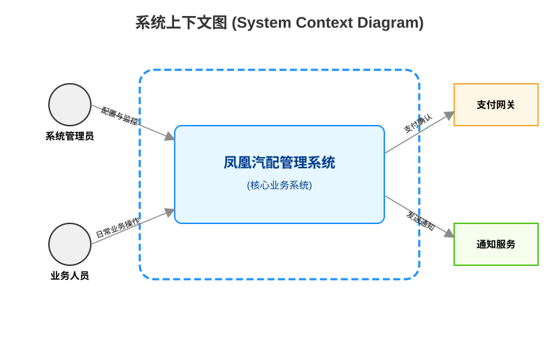

# 项目概述文档

## 1. 引言

本项目旨在开发一个企业级的业务管理平台，以提升企业的管理效率和决策支持能力。

### 1.1 目标

- 提供高效的业务流程管理工具
- 实现数据的集中化管理与分析
- 支持移动端访问与操作

### 1.2 范围

- 业务流程设计与执行
- 数据采集、存储与分析
- 用户管理与权限控制
- 移动端应用开发

### 1.3 系统定位与边界

本系统作为企业核心的业务管理平台，向上对接管理决策，向下支撑日常作业，其系统边界与外部交互如下图所示：

#### 1.3.1 外部参与者

- 管理层：需要决策支持的数据和报告
- 员工：日常业务操作的执行者
- IT 部门：系统的维护与支持

#### 1.3.2 外部系统

- ERP 系统：提供财务、供应链等业务数据
- CRM 系统：提供客户相关数据
- 第三方数据服务：提供市场行情等外部数据

## 2. 需求分析

待补充...