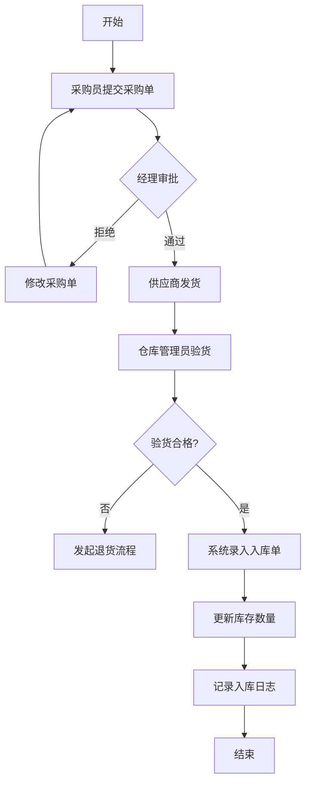
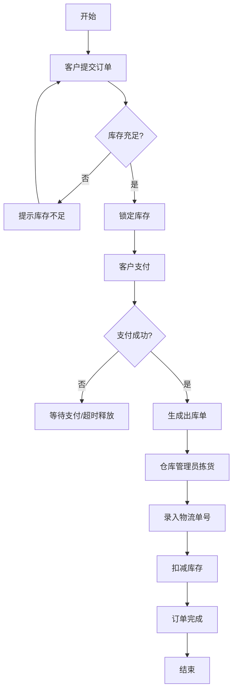
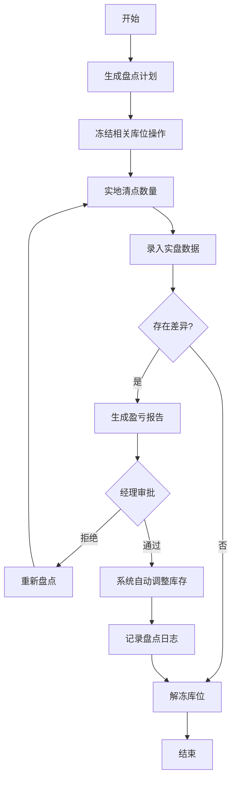

# 凤凰汽配管理系统 - 需求分析文档

## 1. 概述
本章节详细列出了凤凰汽配管理系统的功能性需求与非功能性需求。通过对业务流程的深度剖析，我们将用户需求转化为具体的技术规格，为系统的架构设计和功能实现提供依据。

## 2. 角色定义
系统主要涉及以下四类角色：

| 角色名称 | 职责描述 | 权限范围 |
| :--- | :--- | :--- |
| **超级管理员** | 系统全局配置、用户权限分配、审计日志查看。 | 所有模块 |
| **仓库管理员** | 零件入库、出库、库存盘点、分类维护。 | 零件、库存模块 |
| **销售经理** | 订单审核、客户咨询处理、销售报表查看。 | 交易、报表模块 |
| **普通员工/客户** | 零件查询、采购下单、个人订单管理。 | 查询、下单模块 |

## 3. 功能性需求

### 3.1 零件管理模块 (Part Management)
- **F-PM-01: 零件录入**：支持手动录入零件名称、OEM编号、品牌、规格、适用车型等信息。
- **F-PM-02: 批量导入**：支持通过 Excel 模板批量导入零件数据。
- **F-PM-03: 分类管理**：支持多级分类（如：发动机系统 -> 滤清器 -> 机油滤清器）。
- **F-PM-04: 图片管理**：支持为每个零件上传多张实物照片，并自动生成缩略图。
- **F-PM-05: 兼容性维护**：建立零件与车型的多对多关联关系。

### 3.2 库存控制模块 (Inventory Control)
- **F-IC-01: 入库管理**：记录采购入库单，自动增加对应零件的库存数量。
- **F-IC-02: 出库管理**：根据销售订单生成出库单，自动扣减库存。
- **F-IC-03: 库存预警**：当零件库存低于设定的安全库存值时，系统自动在仪表盘报警。
- **F-IC-04: 盘点功能**：支持定期库存盘点，记录盘盈盘亏情况并调整库存。

### 3.3 交易与订单模块 (Trade & Order)
- **F-TO-01: 采购车**：用户可将所需零件加入采购车，支持修改数量和一键清空。
- **F-TO-02: 订单创建**：从采购车生成正式订单，锁定库存。
- **F-TO-03: 订单追踪**：展示订单从“待支付”、“已发货”到“已完成”的全生命周期状态。
- **F-TO-04: 咨询系统**：用户可针对特定零件发起咨询，后台销售人员实时回复。

### 3.4 AI 智能服务模块 (AI Services)
- **F-AI-01: 智能搜索**：支持自然语言搜索零件（如“帮我找 2018 款宝马 3 系的刹车片”）。
- **F-AI-02: 故障诊断建议**：根据用户描述的故障现象，推荐可能的故障零件。
- **F-AI-03: 自动分类**：利用 AI 对新录入的零件描述进行自动分类建议。

### 3.5 监控与报表模块 (Monitoring & Reporting)
- **F-MR-01: 业务仪表盘**：实时显示今日成交额、新增咨询、库存周转率。
- **F-MR-02: 性能监控**：监控数据库连接池状态、API 响应延迟。
- **F-MR-03: 操作审计**：记录所有管理员的关键操作（增删改），支持追溯。

## 4. 非功能性需求

### 4.1 性能需求
- **响应时间**：95% 的查询请求应在 500ms 内完成。
- **并发能力**：系统应能支持至少 100 个并发用户同时在线操作。
- **吞吐量**：支持每秒处理至少 50 个订单创建请求。

### 4.2 可靠性需求
- **平均无故障时间 (MTBF)**：应大于 5000 小时。
- **数据备份**：每日凌晨 2:00 自动进行全量数据库备份，保留最近 30 天备份。

### 4.3 安全性需求
- **身份认证**：采用 JWT (JSON Web Token) 进行无状态身份验证。
- **密码存储**：所有用户密码必须经过 Argon2 或 BCrypt 强哈希加密存储。
- **传输加密**：生产环境必须强制使用 HTTPS 协议。

### 4.4 易用性需求
- **界面响应式**：前端界面需适配 PC 端和 Pad 端。
- **多语言支持**：系统架构需预留 i18n 接口，首期支持简体中文。

## 5. 详细用例描述 (Use Cases)

### UC-01: 零件入库流程
- **参与者**：仓库管理员
- **前置条件**：管理员已登录系统。
- **基本路径**：
  1. 管理员进入“库存管理”页面。
  2. 点击“新增入库”。
  3. 扫描零件条码或手动输入 OEM 编号。
  4. 系统自动检索零件基本信息。
  5. 管理员输入入库数量、单价及存放库位。
  6. 点击提交，系统更新库存表并记录入库日志。
- **后置条件**：零件库存增加，入库单状态变为“已完成”。

### UC-02: 智能零件搜索
- **参与者**：普通客户
- **前置条件**：无（支持游客搜索）。
- **基本路径**：
  1. 用户在搜索框输入“奥迪 A6L 2.0T 火花塞”。
  2. 前端将请求发送至 AI 接口。
  3. AI 模块解析关键词，提取车型（奥迪 A6L）、排量（2.0T）、零件名（火花塞）。
  4. 系统根据解析结果在数据库中进行模糊匹配和兼容性过滤。
  5. 返回匹配度最高的零件列表。
- **后置条件**：用户看到精准的搜索结果。

### UC-03: 零件批量导入
- **参与者**：管理员
- **前置条件**：管理员已准备好符合模板要求的 Excel 文件。
- **基本路径**：
  1. 管理员进入“零件管理”页面。
  2. 点击“批量导入”按钮。
  3. 选择本地 Excel 文件并上传。
  4. 系统解析文件，校验数据格式及 OEM 码唯一性。
  5. 系统展示校验结果（成功数、失败数及失败原因）。
  6. 管理员确认导入。
- **后置条件**：数据库批量新增零件记录。

### UC-04: 订单退款处理
- **参与者**：销售经理、客户
- **基本路径**：
  1. 客户发起退款申请。
  2. 销售经理在后台收到退款待办。
  3. 经理查看订单详情及退款原因。
  4. 经理点击“同意退款”。
  5. 系统调用支付接口执行原路退回。
  6. 系统恢复对应零件的库存。
  7. 订单状态更新为“已退款”。

### UC-05: 权限角色分配
- **参与者**：超级管理员
- **基本路径**：
  1. 管理员进入“用户管理”。
  2. 选择目标用户，点击“编辑权限”。
  3. 在角色列表中选择“仓库员”。
  4. 点击保存。
- **后置条件**：该用户下次登录时将仅拥有仓库相关权限。

### UC-06: 库存盘点与调整
- **参与者**：仓库管理员
- **基本路径**：
  1. 管理员打印盘点单。
  2. 实地核对库存数量。
  3. 在系统中输入实盘数量。
  4. 系统自动计算盈亏。
  5. 管理员提交调整申请。
  6. 经理审批通过后，系统自动修正库存。

### UC-07: 销售报表导出
- **参与者**：销售经理
- **基本路径**：
  1. 进入“统计报表”页面。
  2. 选择时间范围（如：上个月）。
  3. 选择报表类型（如：零件销量排行）。
  4. 点击“导出 PDF”。
- **后置条件**：浏览器下载生成的报表文件。

### UC-08: 智能故障诊断
- **参与者**：普通客户
- **基本路径**：
  1. 用户打开 AI 助手。
  2. 输入“刹车时有尖锐的金属摩擦声”。
  3. AI 分析关键词“刹车”、“金属摩擦声”。
  4. AI 提示可能是刹车片磨损至极限，建议检查刹车片。
  5. AI 自动展示适配该用户车型的刹车片列表。

### UC-09: 系统参数配置
- **参与者**：超级管理员
- **基本路径**：
  1. 进入“系统设置”。
  2. 修改“低库存预警阈值”为 20。
  3. 修改“订单超时自动取消时间”为 60 分钟。
  4. 点击保存。
- **后置条件**：系统全局逻辑立即按新参数运行。

### UC-10: 操作审计追溯
- **参与者**：超级管理员
- **基本路径**：
  1. 发现某零件价格被异常修改。
  2. 进入“审计日志”页面。
  3. 筛选目标表为 `parts`，操作类型为 `UPDATE`。
  4. 找到对应记录，查看操作人、操作时间及修改前后的价格对比。

## 6. 用户故事 (User Stories)

### US-01: 零件录入
作为一名仓库管理员，我希望能够快速录入新零件信息，以便及时更新库存。

### US-02: 订单处理
作为一名销售经理，我希望能够方便地处理客户订单，包括审核、发货和退款，以提高工作效率。

### US-03: 库存管理
作为一名仓库管理员，我希望系统能够自动预警低库存零件，以便我及时补货。

### US-04: 数据统计
作为一名销售经理，我希望能够导出销售报表，以便于我分析销售业绩和趋势。

## 7. 数据库设计 (Database Design)

### 7.1 主要数据表

- **用户表 (users)**：
  - `id`: 主键
  - `username`: 用户名
  - `password_hash`: 密码哈希
  - `role`: 角色（超级管理员、仓库管理员、销售经理、普通员工/客户）
  - `created_at`: 创建时间
  - `updated_at`: 更新时间

- **零件表 (parts)**：
  - `id`: 主键
  - `oem_code`: OEM 码
  - `name`: 零件名称
  - `brand`: 品牌
  - `specification`: 规格
  - `compatible_models`: 适用车型（JSON 格式存储多对多关系）
  - `created_at`: 创建时间
  - `updated_at`: 更新时间

- **库存表 (inventory)**：
  - `id`: 主键
  - `part_id`: 零件 ID（外键关联至零件表）
  - `quantity`: 库存数量
  - `safety_stock`: 安全库存值
  - `created_at`: 创建时间
  - `updated_at`: 更新时间

- **订单表 (orders)**：
  - `id`: 主键
  - `user_id`: 用户 ID（外键关联至用户表）
  - `status`: 订单状态（待支付、已发货、已完成、已退款）
  - `total_amount`: 订单总金额
  - `created_at`: 创建时间
  - `updated_at`: 更新时间

- **订单明细表 (order_items)**：
  - `id`: 主键
  - `order_id`: 订单 ID（外键关联至订单表）
  - `part_id`: 零件 ID（外键关联至零件表）
  - `quantity`: 购买数量
  - `unit_price`: 单价
  - `created_at`: 创建时间
  - `updated_at`: 更新时间

## 8. 接口设计 (API Design)

### 8.1 用户认证接口
- **POST /api/auth/login**：用户登录，返回 JWT。
- **POST /api/auth/logout**：用户注销，失效 JWT。

### 8.2 零件管理接口
- **GET /api/parts**：获取零件列表，支持分页和模糊搜索。
- **POST /api/parts**：新增零件。
- **PUT /api/parts/{id}**：更新零件信息。
- **DELETE /api/parts/{id}**：删除零件。

### 8.3 库存管理接口
- **GET /api/inventory**：获取库存列表。
- **POST /api/inventory/inbound**：零件入库。
- **POST /api/inventory/outbound**：零件出库。

### 8.4 订单管理接口
- **GET /api/orders**：获取订单列表，支持根据用户 ID 查询。
- **POST /api/orders**：创建新订单。
- **PUT /api/orders/{id}/ship**：订单发货。
- **PUT /api/orders/{id}/refund**：订单退款。

### 8.5 报表统计接口
- **GET /api/reports/sales**：获取销售报表数据。
- **GET /api/reports/inventory**：获取库存报表数据。

## 9. 第三方服务集成 (Third-party Services Integration)
- **支付接口**：集成支付宝、微信支付进行订单支付。
- **物流接口**：集成顺丰、圆通等物流公司接口，提供实时物流信息查询。

## 10. 用户操作手册 (User Manual)

### 10.1 管理员后台操作
1. **登录系统**：访问 `/admin`，输入管理员账号密码。
2. **零件录入**：
   - 点击左侧菜单“零件管理”。
   - 点击“新增零件”，填写 OEM 码、名称、品牌。
   - 上传零件实物图。
   - 在“适用车型”中勾选该零件支持的车型。
3. **库存调整**：
   - 进入“库存管理”。
   - 找到目标零件，点击“入库”或“出库”。
   - 输入变动数量及备注原因。
4. **订单审核**：
   - 进入“订单中心”。
   - 查看状态为“待发货”的订单。
   - 确认库存充足后，点击“发货”并输入物流单号。

### 10.2 客户门户操作
1. **零件搜索**：
   - 在首页搜索框输入零件名或 OEM 码。
   - 使用左侧分类树进行层级筛选。
   - 点击“AI 助手”进行自然语言咨询。
2. **采购下单**：
   - 在零件详情页点击“加入采购车”。
   - 进入采购车页面，核对数量。
   - 点击“去结算”，选择支付方式并提交。
3. **订单追踪**：
   - 在“我的订单”中查看订单实时状态。
   - 订单完成后可进行评价。

## 11. 常见问题解答 (FAQ)

### Q1: 为什么我搜索不到某个 OEM 码？
**A**: 请检查 OEM 码输入是否正确（不区分大小写，但需包含连字符）。若确认无误仍搜索不到，可能是该零件尚未录入系统，请联系管理员。

### Q2: 订单提交后可以修改地址吗？
**A**: 在订单状态为“待发货”之前，您可以联系客服修改地址。一旦进入“已发货”状态，将无法在线修改。

### Q3: 库存预警是如何触发的？
**A**: 系统会根据每个零件设置的 `min_stock` 值进行实时比对。当 `当前库存 < min_stock` 时，系统会自动在管理员仪表盘生成一条预警记录。

## 12. 业务规则详细定义 (Business Rules)
1. **唯一性规则**：OEM 码在全系统中必须唯一。
2. **库存锁定规则**：订单创建后，对应库存将被锁定 30 分钟。若 30 分钟内未支付，库存自动释放。
3. **权限继承规则**：超级管理员拥有所有权限，其他角色权限由超级管理员分配且不可自我修改。
4. **价格保护规则**：零件价格修改后，已生成的订单金额保持不变，仅对新订单生效。
5. **退货规则**：仅支持“已完成”状态且在 7 天内的订单发起退货申请。

## 13. 核心业务流程图 (Business Process Flows)

### 13.1 采购入库流程

### 13.2 销售出库流程

### 13.3 库存盘点流程

## 14. 业务规则详细定义 (Business Rules)
1. **零件唯一性**：OEM 编号 + 品牌 必须在全系统中唯一。
2. **库存锁定**：订单创建后，库存锁定 30 分钟。若未支付，系统自动释放锁定并恢复可用库存。
3. **权限继承**：子分类自动继承父分类的属性，但可进行覆盖。
4. **价格保护**：已生成的订单不受后续零件价格调整的影响。
5. **退货时效**：仅支持订单完成后 7 天内的退货申请。

## 15. 需求评审结论
- **完整性**：涵盖了汽配管理的核心业务场景。
- **一致性**：各模块间的数据流转逻辑清晰，无冲突。
- **可行性**：技术方案成熟，能够满足业务性能要求。

## 2.6 详细用户故事 (User Stories)

为了更好地理解业务场景，我们定义了以下用户故事：

| 编号 | 角色 | 描述 | 验收标准 |
| :--- | :--- | :--- | :--- |
| US-01 | 仓库管理员 | 我希望能够通过扫描零件上的条形码快速办理入库 | 系统能识别条码并自动填充零件基本信息，只需输入数量 |
| US-02 | 销售人员 | 我希望在开单时能看到该零件在不同仓库的实时库存 | 订单编辑界面实时显示各仓库存量，支持跨仓调拨建议 |
| US-03 | 财务人员 | 我希望系统能自动生成每月的销售利润报表 | 报表包含销售额、成本、毛利及毛利率，支持导出 Excel |
| US-04 | 系统管理员 | 我希望能够限制普通员工查看零件的进货价格 | 权限设置中可勾选“隐藏敏感价格”选项，生效后相关界面脱敏 |
| US-05 | 采购经理 | 我希望系统能根据历史销量自动提醒我哪些零件需要补货 | 系统每日计算建议采购量，并在首页显示补货提醒列表 |

## 2.7 未来扩展需求 (Future Roadmap)

虽然当前版本已满足核心业务，但系统设计预留了以下扩展空间：

1.  **移动端 App/小程序**：支持外勤人员现场查询库存、拍照上传零件损毁情况。
2.  **智能推荐引擎**：基于大数据分析，为客户推荐关联零件（如买刹车片推荐刹车油）。
3.  **供应商平台集成**：与主流汽配供应商系统对接，实现一键下单、自动对账。
4.  **多门店连锁支持**：支持集团化管理，实现多门店间的库存共享与财务独立核算。
5.  **AI 图像识别**：通过拍摄零件照片自动识别型号和 OE 号，降低人工录入成本。

## 2.8 业务规则约束 (Business Rules)

-   **库存不为负**：除非开启“允许负库存销售”配置，否则系统禁止销售超过当前库存的零件。
-   **订单不可逆**：已完成财务结算的订单禁止修改，只能通过“销售退货”流程处理。
-   **唯一性约束**：零件 OE 号在系统中必须唯一，防止重复录入。
-   **操作留痕**：所有涉及金额和库存变动的操作必须记录操作人及时间戳。