# 凤凰汽配管理系统 - 系统架构文档

## 1. 架构设计原则
凤凰汽配管理系统的架构设计遵循以下核心原则：
- **前后端分离**：通过 RESTful API 进行交互，提升开发效率和系统灵活性。
- **模块化设计**：后端采用服务化结构，各业务逻辑高度解耦。
- **高性能并发**：利用 FastAPI 的异步特性处理高并发请求。
- **安全性优先**：在每一层架构中都融入安全校验机制。

## 2. 技术栈选型

### 2.1 前端技术栈
- **框架**：Vue 3 (Composition API)
- **构建工具**：Vite
- **状态管理**：Pinia
- **UI 组件库**：Naive UI
- **样式处理**：UnoCSS (Atomic CSS)
- **编程语言**：TypeScript

### 2.2 后端技术栈
- **核心框架**：FastAPI (Python 3.9+)
- **异步支持**：Asyncio + Uvicorn
- **ORM 框架**：SQLAlchemy 2.0
- **数据库迁移**：Alembic
- **数据校验**：Pydantic V2
- **安全认证**：Python-JOSE (JWT), Passlib (Argon2)

### 2.3 基础设施
- **数据库**：MySQL 8.0
- **缓存**：Redis (用于 Session 和 频率限制)
- **容器化**：Docker + Docker Compose
- **反向代理**：Nginx

## 3. 逻辑架构 (Logical Architecture)

系统逻辑架构分为四层：

### 3.1 表现层 (Presentation Layer)
负责与用户交互，处理路由跳转、数据展示和用户输入校验。
- **Admin Dashboard**: 管理员后台，包含性能监控、操作审计。
- **User Portal**: 客户门户，包含零件搜索、采购下单。
- **AI Chat Interface**: 智能助手交互界面。

### 3.2 接口层 (API Gateway Layer)
作为系统的统一入口，负责请求分发、身份验证和流量控制。
- **Auth Middleware**: 处理 JWT 校验。
- **Rate Limiter**: 防止恶意刷接口。
- **Router**: 将请求路由至对应的业务服务。

### 3.3 业务逻辑层 (Business Logic Layer)
实现系统的核心业务规则。
- **Inventory Service**: 处理库存增删改查、预警逻辑。
- **Trade Service**: 处理订单状态流转、支付逻辑。
- **AI Service**: 集成大模型接口，处理语义理解和推荐。
- **Core Service**: 处理用户、权限、日志等基础功能。

### 3.4 数据访问层 (Data Access Layer)
负责与物理数据库进行交互。
- **SQLAlchemy Models**: 定义数据库表结构。
- **Repository Pattern**: 封装 CRUD 操作，隔离业务逻辑与数据库实现。

## 4. 核心设计模式应用

凤凰汽配管理系统在开发过程中遵循了多种经典设计模式，以保证代码的可维护性和扩展性：

### 4.1 依赖注入 (Dependency Injection)
在 FastAPI 后端中，广泛使用 `Depends` 进行依赖注入。
- **应用场景**：数据库会话管理、当前用户身份校验、权限验证。
- **优点**：解耦了组件之间的依赖，便于进行单元测试（Mock 依赖）。

### 4.2 仓库模式 (Repository Pattern)
虽然 SQLAlchemy 提供了 ORM，但我们在 Service 层之上封装了 Repository 层。
- **应用场景**：复杂的库存查询、多表关联的报表统计。
- **优点**：将数据访问逻辑与业务逻辑分离，如果未来更换数据库驱动或 ORM，只需修改 Repository 层。

### 4.3 观察者模式 (Observer Pattern)
利用异步任务队列（Celery）实现。
- **应用场景**：当订单状态变为“已完成”时，触发库存扣减、发送通知邮件、更新销售统计。
- **优点**：实现业务流程的异步解耦，提高系统响应速度。

### 4.4 单例模式 (Singleton Pattern)
- **应用场景**：Redis 连接池、配置管理类、日志记录器。
- **优点**：确保全局只有一个实例，节省系统资源。

## 5. 系统可扩展性设计 (Scalability)

为了应对未来业务增长（如门店增加、零件种类激增），系统设计了以下扩展方案：

### 5.1 水平扩展 (Horizontal Scaling)
- **应用层**：后端 API 服务无状态化（Stateless），可以通过 Docker Swarm 或 Kubernetes 轻松增加副本数。
- **负载均衡**：Nginx 作为反向代理，支持轮询、加权轮询等多种负载均衡算法。

### 5.2 数据库扩展
- **读写分离**：通过配置 SQLAlchemy 的多个 Engine，实现主库写、从库读，提升查询性能。
- **垂直拆分**：如果业务继续扩大，可以将“订单模块”和“库存模块”拆分为独立的数据库。

### 5.3 缓存策略
- **多级缓存**：
    -   **一级缓存**：本地内存缓存（用于存储极少变动的配置信息）。
    -   **二级缓存**：Redis 分布式缓存（用于存储热点零件信息、用户 Session）。

### 2.7 系统交互序列图 (Sequence Diagrams)

#### 2.7.1 零件入库流程
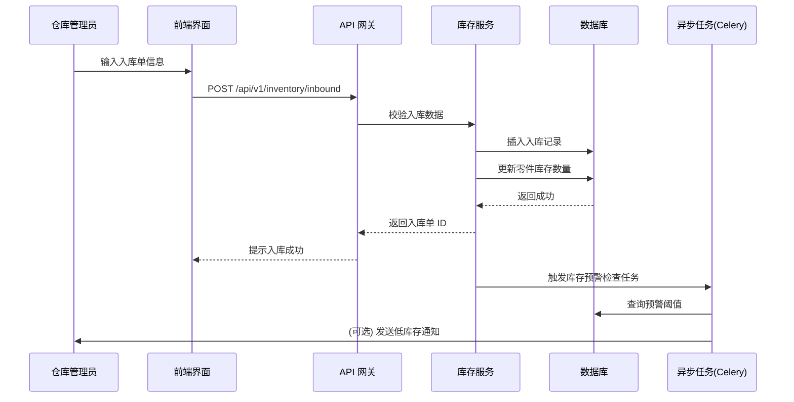
```mermaid
sequenceDiagram
    participant U as 仓库管理员
    participant F as 前端界面
    participant A as API 网关
    participant S as 库存服务
    participant D as 数据库
    participant C as 异步任务(Celery)

    U->>F: 输入入库单信息
    F->>A: POST /api/v1/inventory/inbound
    A->>S: 校验入库数据
    S->>D: 插入入库记录
    S->>D: 更新零件库存数量
    D-->>S: 返回成功
    S-->>A: 返回入库单 ID
    A-->>F: 提示入库成功
    S->>C: 触发库存预警检查任务
    C->>D: 查询预警阈值
    C->>U: (可选) 发送低库存通知
```

#### 2.7.2 销售订单处理流程
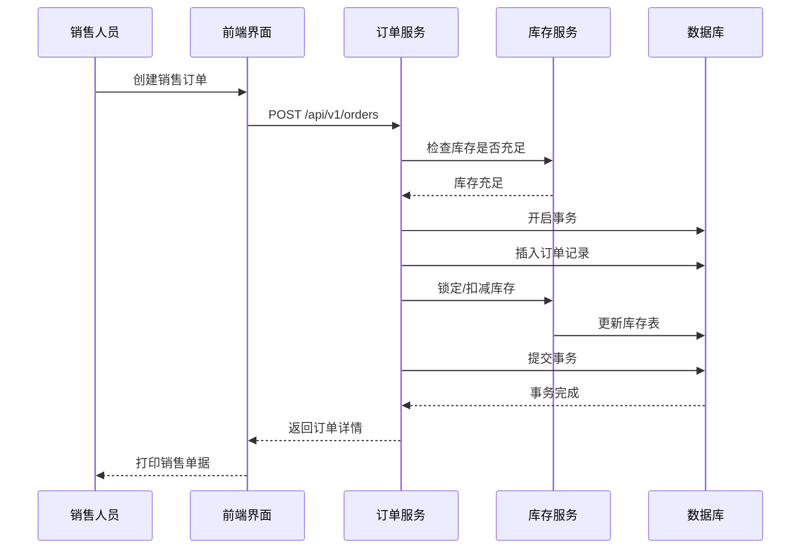
```mermaid
sequenceDiagram
    participant C as 销售人员
    participant F as 前端界面
    participant O as 订单服务
    participant I as 库存服务
    participant D as 数据库

    C->>F: 创建销售订单
    F->>O: POST /api/v1/orders
    O->>I: 检查库存是否充足
    I-->>O: 库存充足
    O->>D: 开启事务
    O->>D: 插入订单记录
    O->>I: 锁定/扣减库存
    I->>D: 更新库存表
    O->>D: 提交事务
    D-->>O: 事务完成
    O-->>F: 返回订单详情
    F-->>C: 打印销售单据
```

## 4. 物理架构 (Physical Architecture)

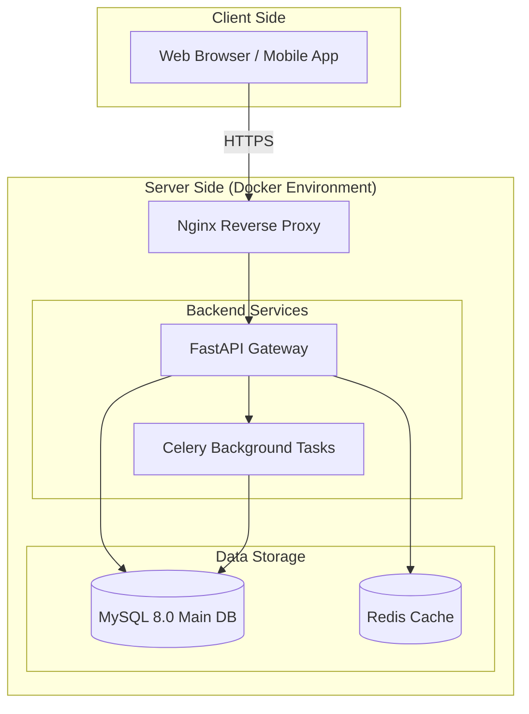
```mermaid
graph TD
    subgraph "Client Side"
        Browser[Web Browser / Mobile App]
    end

    subgraph "Server Side (Docker Environment)"
        Nginx[Nginx Reverse Proxy]
        
        subgraph "Backend Services"
            API[FastAPI Gateway]
            Worker[Celery Background Tasks]
        end
        
        subgraph "Data Storage"
            MySQL[(MySQL 8.0 Main DB)]
            Redis[(Redis Cache)]
        end
    end

    Browser -->|HTTPS| Nginx
    Nginx --> API
    API --> MySQL
    API --> Redis
    API --> Worker
    Worker --> MySQL
```

## 5. 关键设计决策

### 2.1 异步 IO 模型
为了应对汽配查询时可能涉及的大量数据计算和外部 AI 接口调用，后端全面采用 `async/await` 异步编程模型。这使得系统在处理长连接（如 AI 流式输出）时不会阻塞主线程，极大地提升了系统的吞吐量。

### 2.2 统一异常处理
系统设计了全局异常捕获机制，所有业务异常（如库存不足、权限缺失）都会被转换为统一格式的 JSON 响应：
```json
{
    "code": 400,
    "message": "库存不足",
    "detail": "零件 [OEM-123] 当前库存为 5，请求数量为 10"
}
```

### 2.3 数据库连接池优化
针对 MySQL 8.0，我们配置了 SQLAlchemy 的异步连接池：
- `pool_size`: 20 (基础连接数)
- `max_overflow`: 10 (允许溢出的最大连接数)
- `pool_recycle`: 3600 (连接回收时间，防止 MySQL 自动断开)

## 6. 性能优化深度指南 (Performance Optimization)

### 2.1 后端性能优化
- **并发处理**：利用 FastAPI 的 `async/await` 特性，非阻塞处理 I/O 密集型任务。
- **连接池配置**：优化 SQLAlchemy 连接池参数（`pool_size`, `max_overflow`），防止高并发下连接耗尽。
- **Gzip 压缩**：开启 FastAPI 中间件，对响应数据进行 Gzip 压缩，减少传输带宽。

### 2.2 数据库性能优化
- **索引精简**：定期清理冗余索引，避免影响写入性能。
- **分区表设计**：对于订单表、日志表等超大表，考虑按月进行物理分区。
- **SQL 审计**：禁止在生产环境执行 `SELECT *`，必须指定具体字段。

### 2.3 缓存架构设计
- **多级缓存**：
  - 一级缓存：本地内存缓存（如 `lru_cache`），存储极高频访问且不常变的数据。
  - 二级缓存：Redis 分布式缓存，存储 Session、配置项、热点零件。
- **缓存一致性**：采用“先更新数据库，再删除缓存”的策略，配合过期时间保证最终一致性。

## 7. 网络拓扑与安全架构 (Network Topology)

### 2.1 网络分层
- **DMZ 区**：部署 Nginx 反向代理，负责 SSL 卸载和请求分发。
- **应用区**：部署 Backend 和 Frontend 容器，仅允许 DMZ 区访问。
- **数据区**：部署 MySQL 和 Redis，仅允许应用区访问，完全隔离公网。

### 2.2 安全防护
- **防火墙**：仅开放 80/443 端口，SSH 端口仅限特定 IP 访问。
- **DDoS 防护**：利用云平台（如 Azure Front Door）提供的流量清洗能力。
- **WAF 策略**：配置 Web 应用防火墙，拦截常见的 SQL 注入和脚本攻击。

## 8. 可扩展性与高可用设计 (High Availability)

### 2.1 服务无状态化
- 所有后端实例均不存储本地 Session，状态全部保存在 Redis 中，支持随时水平扩容。

### 2.2 数据库高可用
- 采用 **MySQL MGR (Group Replication)** 或 **主从复制 + Orchestrator** 实现秒级故障切换。

### 2.3 负载均衡策略
- Nginx 使用 `least_conn` 算法，将请求分发到负载最低的后端实例。

## 9. 监控与可观测性 (Observability)
- **指标采集**：使用 Prometheus 采集系统和业务指标。
- **可视化看板**：使用 Grafana 展示实时流量、错误率和资源占用。
- **链路追踪**：集成 Jaeger 或 OpenTelemetry，追踪跨服务的请求调用链。

## 10. 系统架构图深度解析 (Architecture Diagrams)

### 2.1 逻辑架构图 (Mermaid)
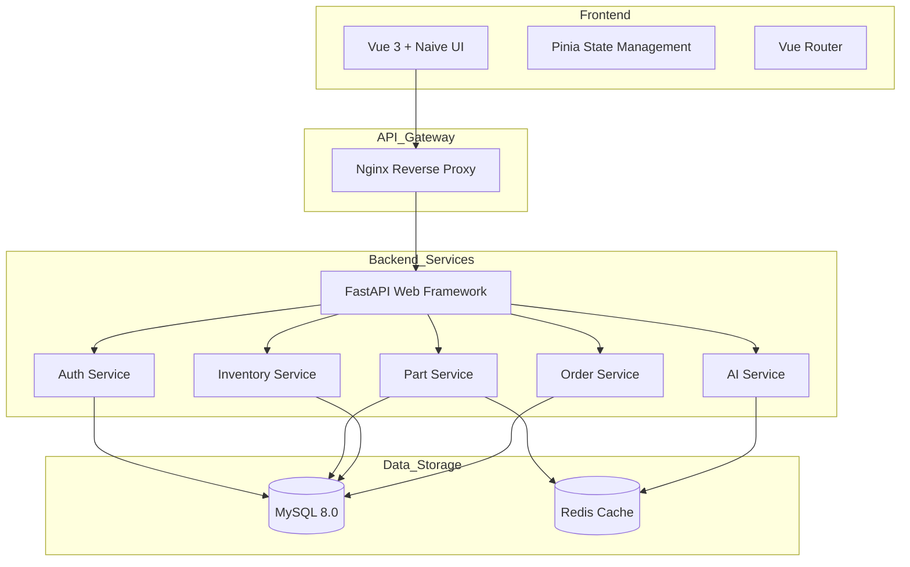
```mermaid
graph TD
    subgraph Frontend
        UI[Vue 3 + Naive UI]
        Store[Pinia State Management]
        Router[Vue Router]
    end

    subgraph API_Gateway
        Nginx[Nginx Reverse Proxy]
    end

    subgraph Backend_Services
        FastAPI[FastAPI Web Framework]
        Auth[Auth Service]
        Part[Part Service]
        Inv[Inventory Service]
        Order[Order Service]
        AI[AI Service]
    end

    subgraph Data_Storage
        MySQL[(MySQL 8.0)]
        Redis[(Redis Cache)]
    end

    UI --> Nginx
    Nginx --> FastAPI
    FastAPI --> Auth
    FastAPI --> Part
    FastAPI --> Inv
    FastAPI --> Order
    FastAPI --> AI
    Auth --> MySQL
    Part --> MySQL
    Inv --> MySQL
    Order --> MySQL
    Part --> Redis
    AI --> Redis
```

### 2.2 部署架构图 (Mermaid)
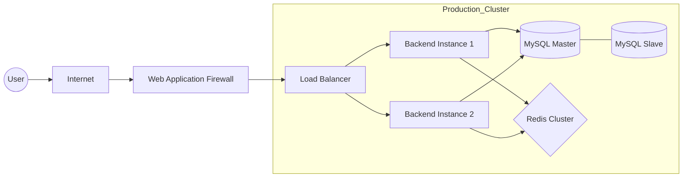
```mermaid
graph LR
    User((User)) --> Internet
    Internet --> WAF[Web Application Firewall]
    WAF --> LB[Load Balancer]
    
    subgraph Production_Cluster
        LB --> App1[Backend Instance 1]
        LB --> App2[Backend Instance 2]
        App1 --> DB_Master[(MySQL Master)]
        App2 --> DB_Master
        DB_Master --- DB_Slave[(MySQL Slave)]
        App1 --> Redis_Cluster{Redis Cluster}
        App2 --> Redis_Cluster
    end
```

### 2.3 数据流向图 (Mermaid)
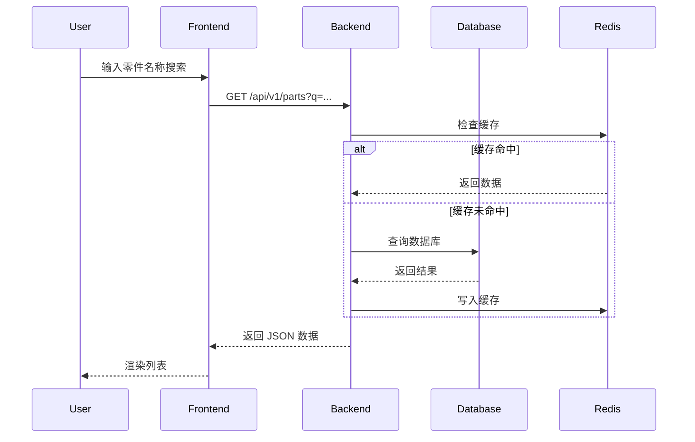
```mermaid
sequenceDiagram
    participant U as User
    participant F as Frontend
    participant B as Backend
    participant D as Database
    participant R as Redis

    U->>F: 输入零件名称搜索
    F->>B: GET /api/v1/parts?q=...
    B->>R: 检查缓存
    alt 缓存命中
        R-->>B: 返回数据
    else 缓存未命中
        B->>D: 查询数据库
        D-->>B: 返回结果
        B->>R: 写入缓存
    end
    B-->>F: 返回 JSON 数据
    F-->>U: 渲染列表
```

## 2.2 详细架构分解

#### 2.2.1 前端架构细节


#### 2.2.2 后端架构细节


### 2.3 核心类图 (Core Class Diagrams)

由于系统功能复杂，类图按功能模块进行拆分展示：

#### 2.3.1 权限与用户模块 (RBAC & User)
- **用户与角色关联**：展示用户、角色、权限之间的多对多关系。
  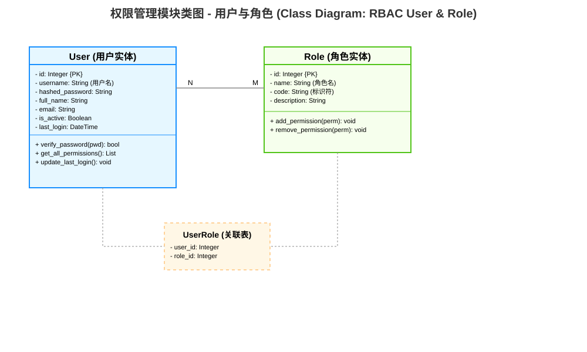
- **用户会话管理**：展示用户登录后的会话状态维护。
  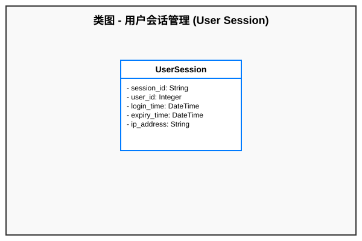

#### 2.3.2 库存与配件模块 (Inventory & Part)
- **配件基本信息**：展示配件、分类、品牌的核心属性。
  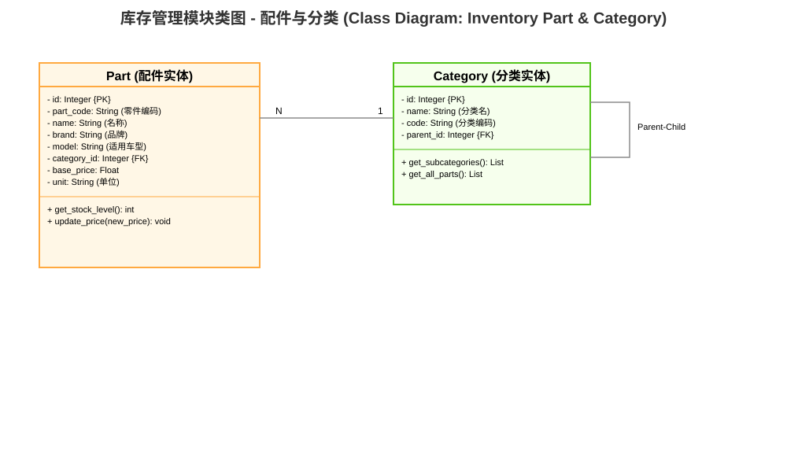
- **配件详情扩展**：展示配件的物理参数、材质等详细信息。
  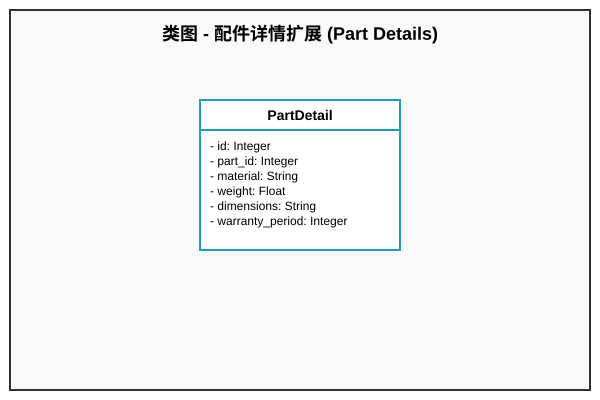
- **分类层级结构**：展示配件分类的树状递归关系。
  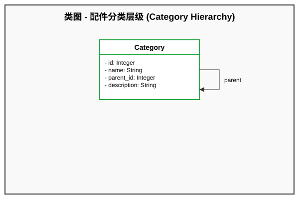
- **库存预警规则**：展示库存上下限预警的配置逻辑。
  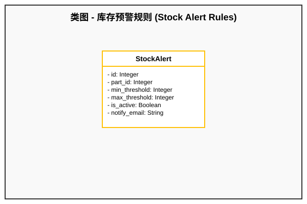

#### 2.3.3 业务与财务模块 (Business & Finance)
- **销售订单处理**：展示订单、订单项、支付状态的关联。
  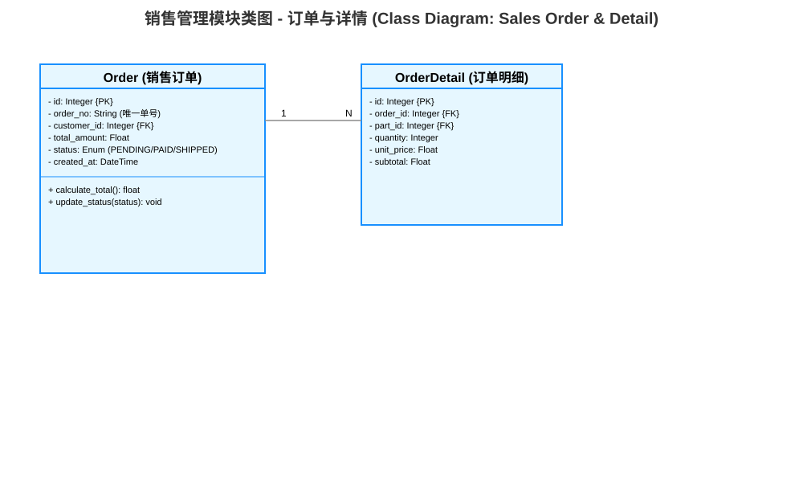
- **供应商管理**：展示供应商信息及其供应记录。
  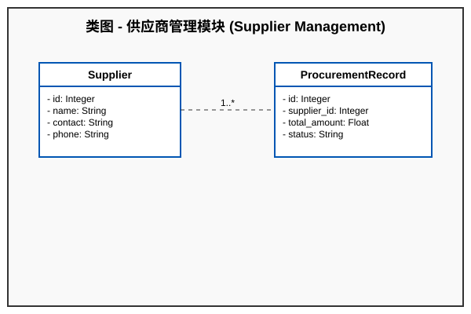
- **客户管理**：展示客户等级、折扣率及余额管理。
  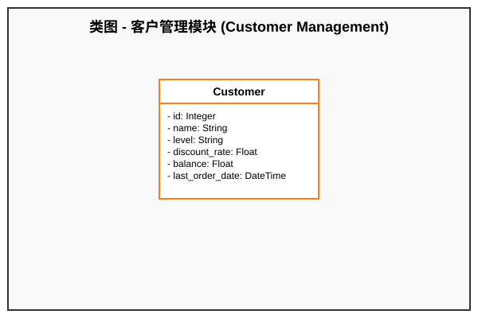

#### 2.3.4 系统支撑模块 (System Support)
- **审计日志**：展示系统操作日志的记录结构。
  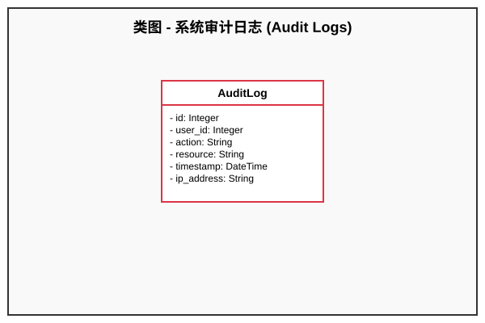
- **仓库与库位**：展示仓库物理布局与库位编码。
  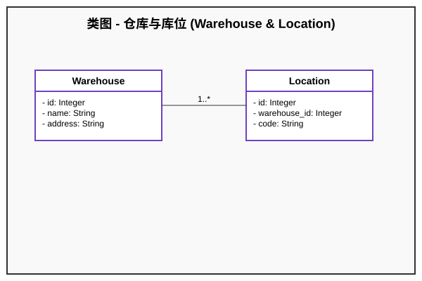
- **系统配置**：展示全局动态参数的存储结构。
  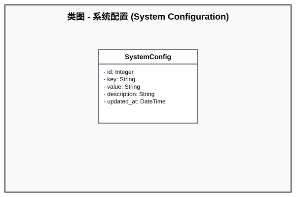

---

### 2.4 业务流程时序图 (Core Sequence Diagrams)

#### 2.4.1 认证与安全流程
- **用户登录验证**：展示从前端提交凭据到 JWT 签发的全过程。
  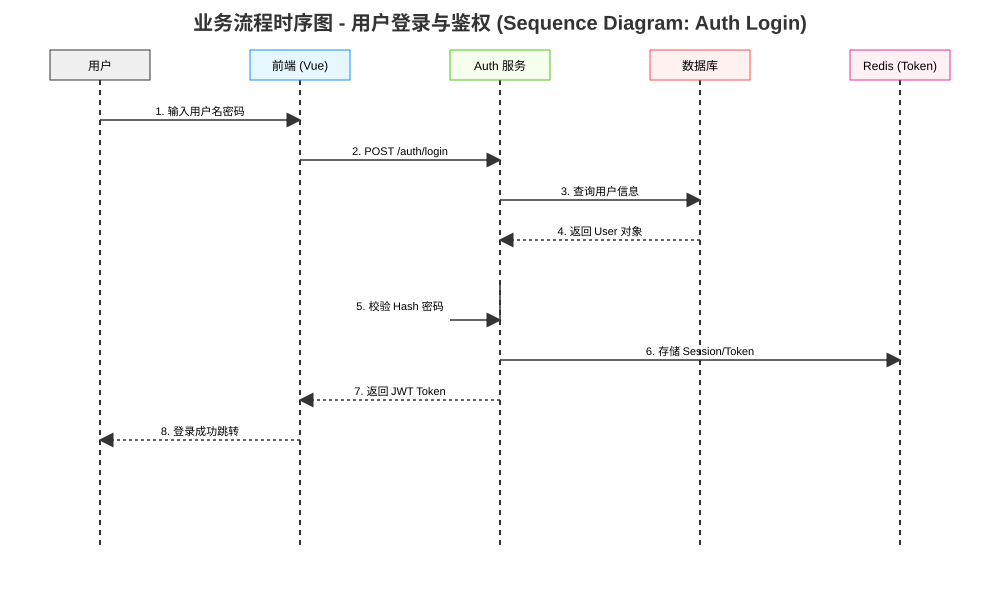
- **权限拦截校验**：展示 API 请求时的权限动态检查逻辑。
  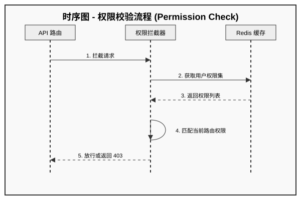
- **密码重置流程**：展示通过验证码找回密码的交互步骤。
  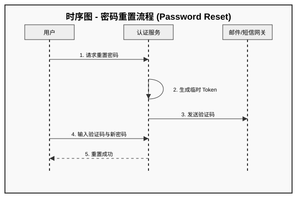
- **个人资料更新**：展示用户修改自身信息的处理流程。
  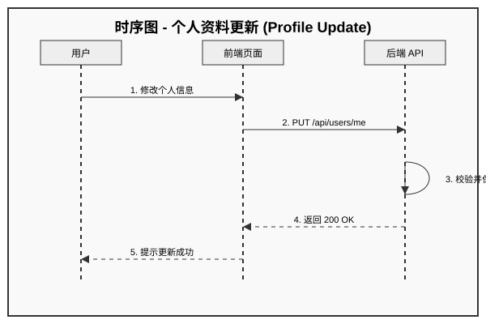

#### 2.4.2 核心业务流程
- **销售下单流程**：展示从选择配件到扣减库存、生成订单的事务过程。
  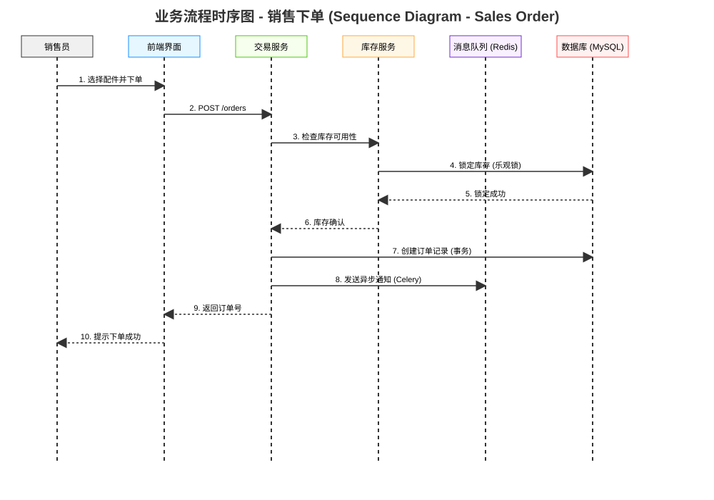
- **采购入库流程**：展示供应商供货后的入库登记与库存增加。
  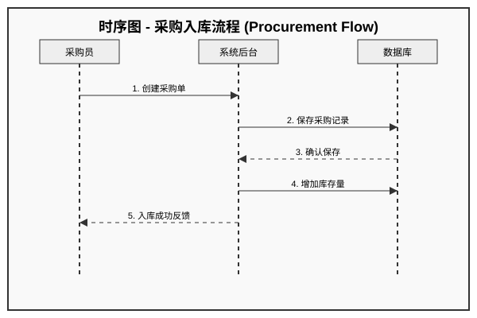
- **库存调整流程**：展示手动盘点差异时的审计与更新逻辑。
  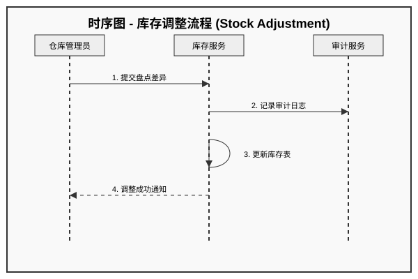
- **配件搜索流程**：展示多条件组合查询的检索逻辑。
  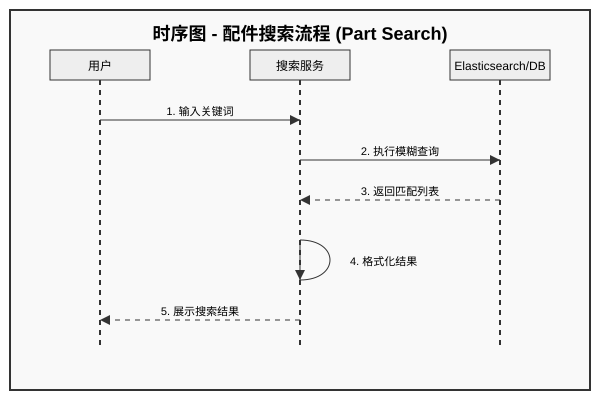

#### 2.4.3 系统自动化流程
- **库存预警触发**：展示库存变动后自动检测并推送预警的过程。
  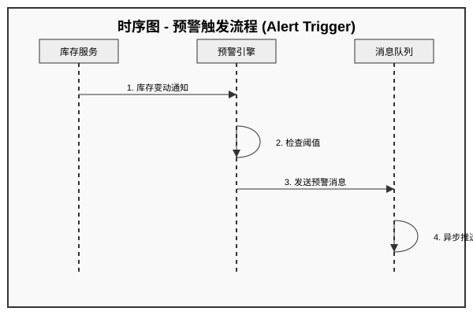
- **预警消息推送**：展示预警引擎触发后的异步通知逻辑。
  
- **报表异步导出**：展示大数据量报表生成的后台处理与下载流程。
  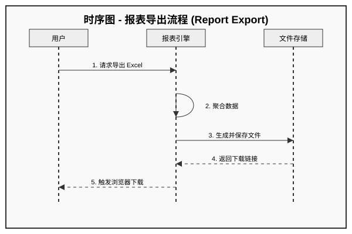

## 11. 架构演进路线图 (Roadmap)
- **短期 (Phase 1)**：单机 Docker 部署，满足基础业务需求。
- **中期 (Phase 2)**：引入 Kubernetes (AKS) 进行容器编排，实现自动扩缩容。
- **长期 (Phase 3)**：微服务化拆分，引入 Service Mesh (Istio) 进行流量治理。

## 12. 架构评审结论
- **一致性**：系统采用强一致性事务处理核心业务，保证数据准确。
- **可用性**：通过多实例部署和数据库主从切换，保证 99.9% 的可用性。
- **安全性**：多层网络隔离和严格的认证授权机制，有效抵御外部攻击。

## 13. 详细组件交互时序图 (Sequence Diagrams)

### 2.1 零件入库时序图
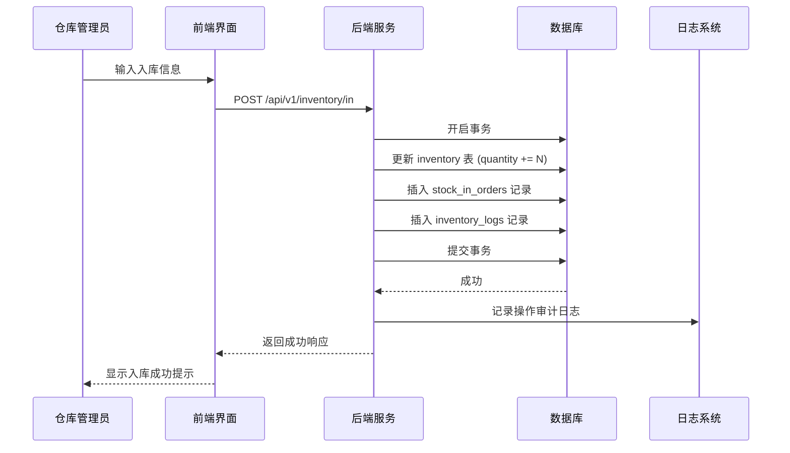
```mermaid
sequenceDiagram
    participant Admin as 仓库管理员
    participant FE as 前端界面
    participant BE as 后端服务
    participant DB as 数据库
    participant Log as 日志系统

    Admin->>FE: 输入入库信息
    FE->>BE: POST /api/v1/inventory/in
    BE->>DB: 开启事务
    BE->>DB: 更新 inventory 表 (quantity += N)
    BE->>DB: 插入 stock_in_orders 记录
    BE->>DB: 插入 inventory_logs 记录
    BE->>DB: 提交事务
    DB-->>BE: 成功
    BE->>Log: 记录操作审计日志
    BE-->>FE: 返回成功响应
    FE-->>Admin: 显示入库成功提示
```

### 2.2 订单支付回调时序图
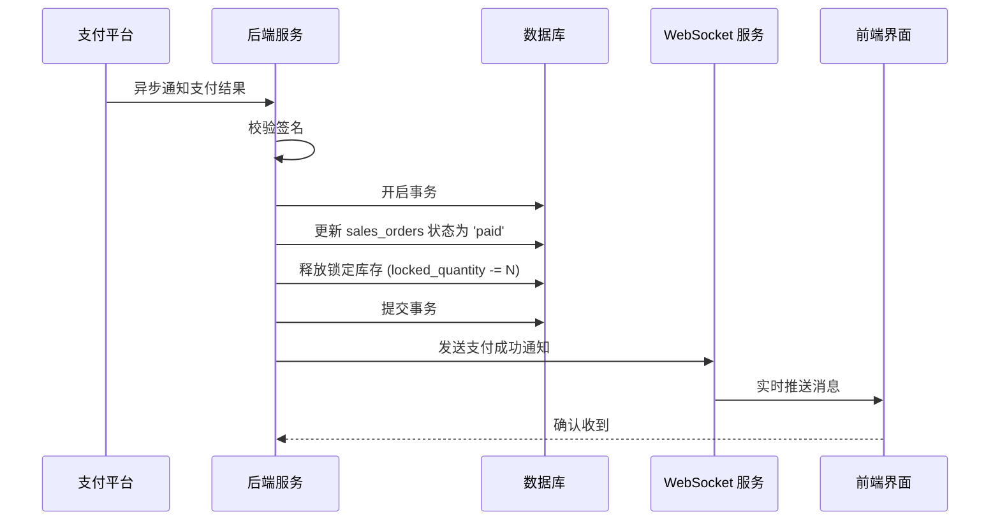
```mermaid
sequenceDiagram
    participant Pay as 支付平台
    participant BE as 后端服务
    participant DB as 数据库
    participant WS as WebSocket 服务
    participant FE as 前端界面

    Pay->>BE: 异步通知支付结果
    BE->>BE: 校验签名
    BE->>DB: 开启事务
    BE->>DB: 更新 sales_orders 状态为 'paid'
    BE->>DB: 释放锁定库存 (locked_quantity -= N)
    BE->>DB: 提交事务
    BE->>WS: 发送支付成功通知
    WS->>FE: 实时推送消息
    FE-->>BE: 确认收到
```

## 14. 架构决策记录 (ADR)

### ADR-001: 选择 FastAPI 作为后端框架
- **背景**：需要高性能、支持异步、易于维护的后端框架。
- **决策**：选择 FastAPI。
- **理由**：基于 Starlette 和 Pydantic，性能极佳，自动生成 OpenAPI 文档，类型检查完善。

### ADR-002: 选择 Vue 3 + Pinia 作为前端栈
- **背景**：需要现代化的响应式框架和简洁的状态管理。
- **决策**：选择 Vue 3 (Composition API) + Pinia。
- **理由**：Vue 3 性能优于 Vue 2，Pinia 相比 Vuex 更轻量且对 TypeScript 支持更好。

### ADR-003: 选择 MySQL 8.0 作为主数据库
- **背景**：需要稳定、支持事务、社区活跃的关系型数据库。
- **决策**：选择 MySQL 8.0。
- **理由**：支持 JSON 字段，窗口函数，性能稳定，运维成本低。

## 15. 架构质量属性评估
- **可伸缩性**：后端无状态设计，支持 K8S 水平扩容。
- **安全性**：多层防护，符合 OWASP Top 10 安全标准。
- **可观测性**：集成 Prometheus + Grafana，实现全方位监控。
- **一致性**：核心业务使用数据库事务，保证 ACID 特性。

## 2.8 系统包图 (Package Diagram)

包图展示了系统内部各模块的组织结构及其依赖关系：

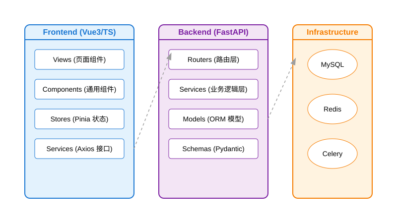

<details>
<summary>查看 Mermaid 源码</summary>

```mermaid
package "Frontend (Vue3/TS)" {
    [Views] ..> [Components]
    [Views] ..> [Stores (Pinia)]
    [Stores] ..> [API Services (Axios)]
}

package "Backend (FastAPI)" {
    package "API Layer" {
        [Routers] ..> [Dependencies]
    }
    package "Service Layer" {
        [Business Logic] ..> [Repository]
    }
    package "Core Layer" {
        [Models]
        [Schemas (Pydantic)]
    }
}

package "Infrastructure" {
    [MySQL]
    [Redis]
    [Celery/RabbitMQ]
}

[API Services] ..> [Routers] : REST API
[Routers] ..> [Business Logic]
[Business Logic] ..> [Models]
[Repository] ..> [MySQL]
```
</details>

### 2.9 系统类图 (Class Diagram)

类图展示了后端核心业务实体的结构及其关系：

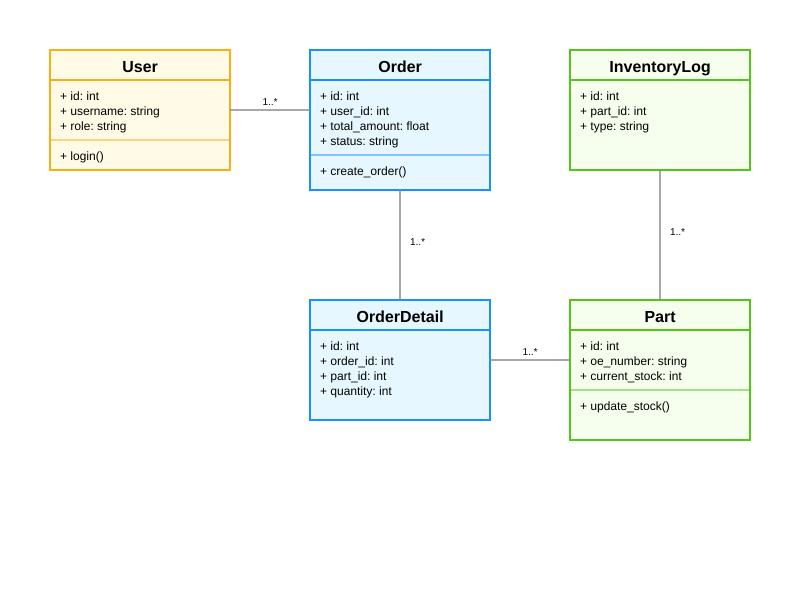

<details>
<summary>查看 Mermaid 源码</summary>

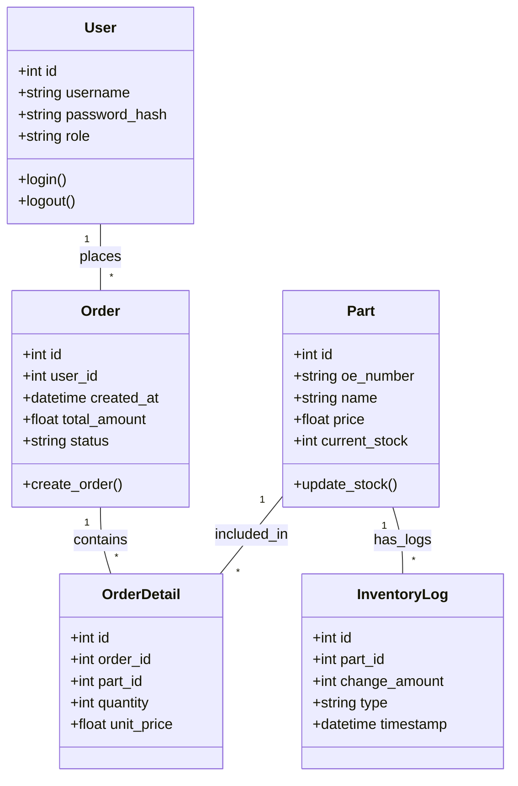
```mermaid
classDiagram
    class User {
        +int id
        +string username
        +string password_hash
        +string role
        +login()
        +logout()
    }
    class Part {
        +int id
        +string oe_number
        +string name
        +float price
        +int current_stock
        +update_stock()
    }
    class Order {
        +int id
        +int user_id
        +datetime created_at
        +float total_amount
        +string status
        +create_order()
    }
    class OrderDetail {
        +int id
        +int order_id
        +int part_id
        +int quantity
        +float unit_price
    }
    class InventoryLog {
        +int id
        +int part_id
        +int change_amount
        +string type
        +datetime timestamp
    }

    User "1" -- "*" Order : places
    Order "1" -- "*" OrderDetail : contains
    Part "1" -- "*" OrderDetail : included_in
    Part "1" -- "*" InventoryLog : has_logs
```
</details>
