# 凤凰汽配管理系统 - 用户界面设计文档

## 1. 设计原则与风格指南

### 1.1 设计语言
本系统采用 **Phoenix Industrial Design (PID)** 风格，强调工业感、专业性与高效交互。
- **主色调**：凤凰绿 (`#18a058`)，象征生命力与安全。
- **辅助色**：深碳黑 (`#2e3235`)，用于标题栏与核心容器，体现工业稳重感。
- **字体**：标题采用粗体斜体 (Black Italic)，正文采用高可读性的无衬线字体。
- **交互组件**：基于 Naive UI 定制，采用大圆角 (`2xl`) 与微阴影 (`shadow-sm`)。

### 1.2 响应式布局
系统全面适配桌面端与移动端，采用 Tailwind CSS 的响应式栅格系统。
- **桌面端**：侧边栏/顶部导航 + 宽屏内容区。
- **移动端**：折叠菜单 + 垂直堆叠布局。

---

## 2. 核心页面详细说明

### 2.1 登录与注册 (Authentication)
用户进入系统的门户，采用毛玻璃效果与动态背景。

- **登录页 (`LoginView.vue`)**：
  - **功能**：支持账号/邮箱登录，提供“管理员”与“普通用户”快速切换入口。
  - **视觉**：深色背景配合凤凰绿光晕装饰。
  - **图片参考**：
    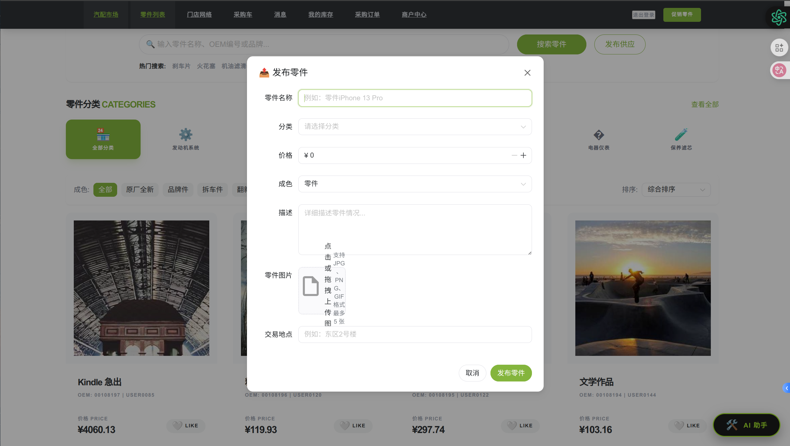

- **注册页 (`RegisterView.vue`)**：
  - **功能**：商户入驻申请，需填写商户名称、执照编号（8-12位）、邮箱及密码。
  - **图片参考**：
    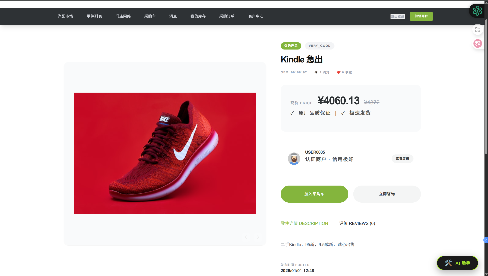

### 2.2 零件市场首页 (Marketplace)
系统的核心业务入口，展示热门零件与分类导航。

- **布局结构**：
  - **Hero Section**：展示限时优惠零件（如 PHOENIX-BC86 制动钳）。
  - **搜索栏**：支持 OEM 编号、品牌、名称检索。
  - **分类导航**：图标化展示发动机、传动、制动等 8 大系统。
  - **零件列表**：瀑布流展示零件卡片，包含图片、价格、成色标签。
- **图片参考**：
  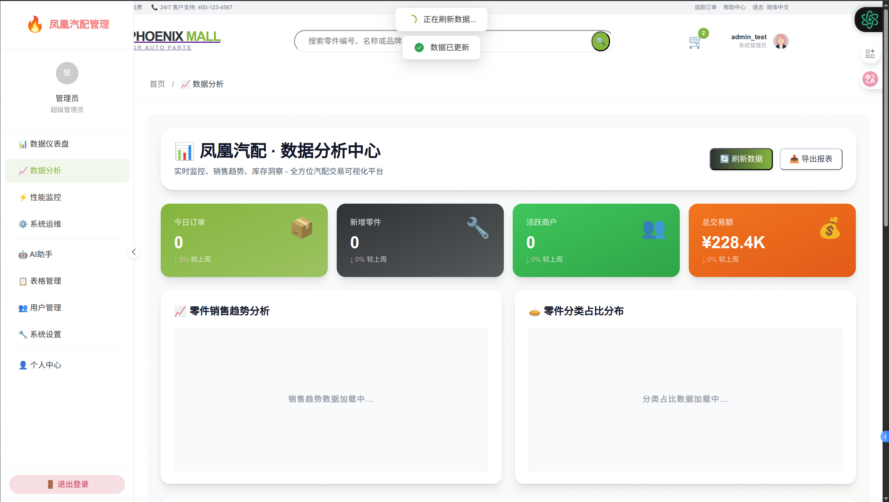
  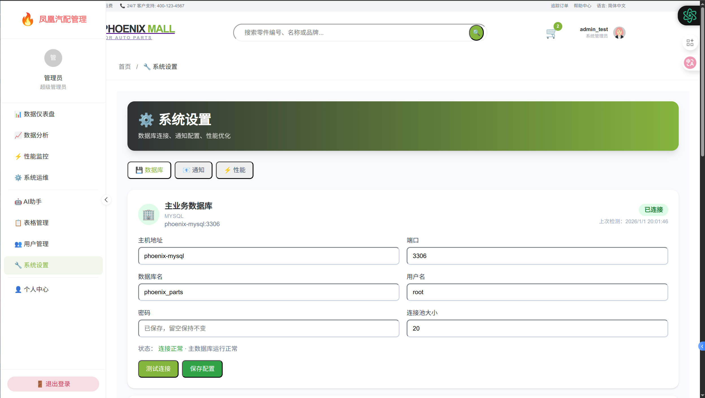

### 2.3 智能检索中心 (Market Search)
提供多维度筛选与高级搜索功能。

- **功能分区**：
  - **左侧筛选栏**：成色（全新/拆车/品牌等）、价格区间、排序方式。
  - **右侧结果区**：展示筛选后的零件，支持管理员视图（显示供应商 ID 与审核状态）。
- **图片参考**：
  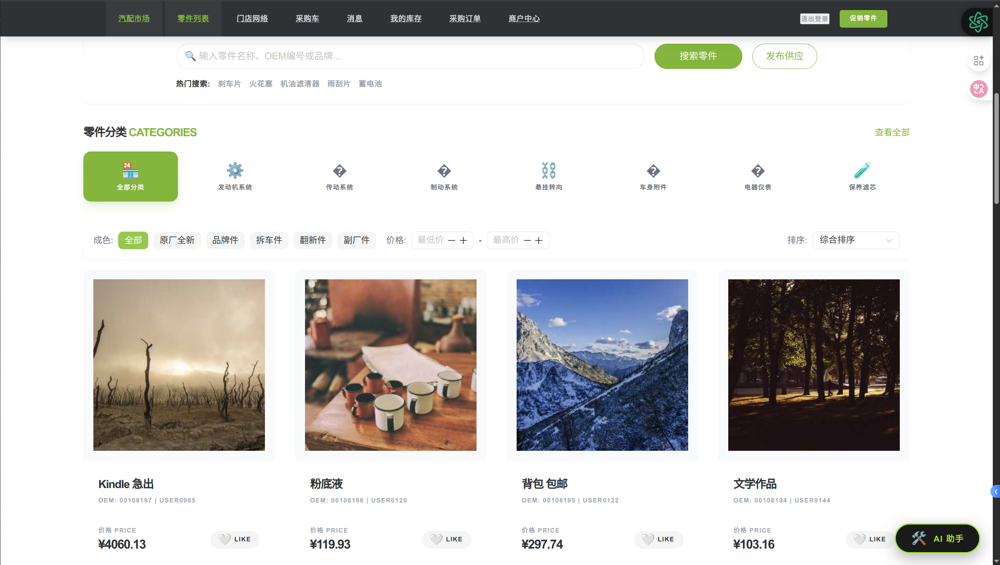

### 2.4 零件详情页 (Item Detail)
展示零件的完整信息与交互操作。

- **核心内容**：
  - **图片轮播**：展示零件多角度实拍图。
  - **参数面板**：OE 号、适用车型、成色说明、库存状态。
  - **供应商信息**：信用评分、响应率、地理位置。
  - **交互**：加入采购车、联系供应商（即时通讯）、收藏。
- **图片参考**：
  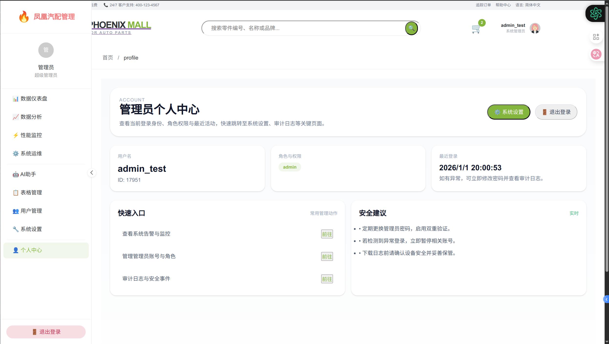
  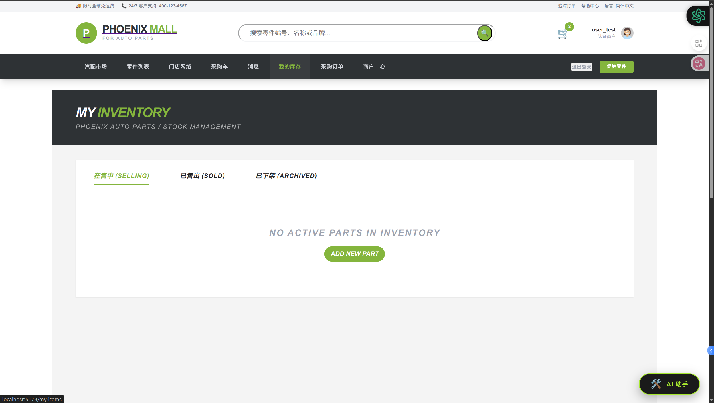

### 2.5 采购车与结算 (Cart & Checkout)
处理交易流程的核心环节。

- **采购车 (`ShoppingCartView.vue`)**：
  - **功能**：支持批量选择、数量调整、失效零件自动标记。
  - **视觉**：采用工业清单风格，总价实时计算。
- **结算页 (`CheckoutView.vue`)**：
  - **功能**：填写物流信息（收货人、电话、地址），确认最终订单。
- **图片参考**：
  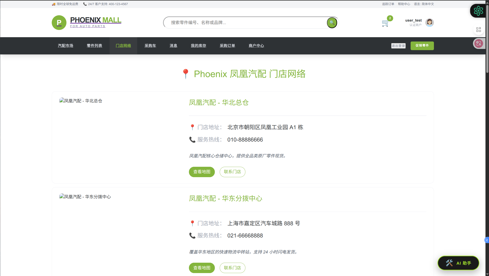
  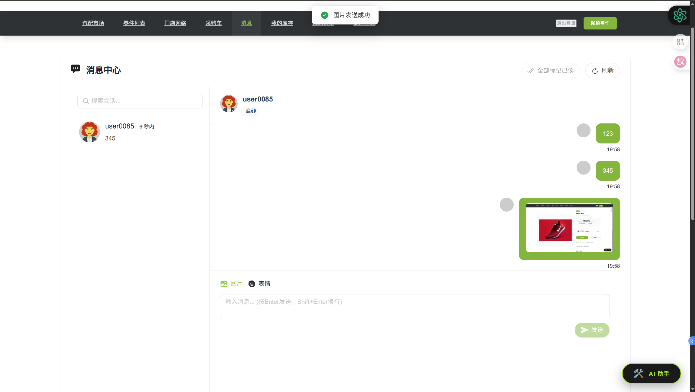

### 2.6 订单管理 (Orders)
追踪采购与销售历史。

- **功能**：
  - **采购订单**：查看已买到的零件，支持联系商户、评价。
  - **销售订单**：查看已卖出的零件，支持确认发货。
- **图片参考**：
  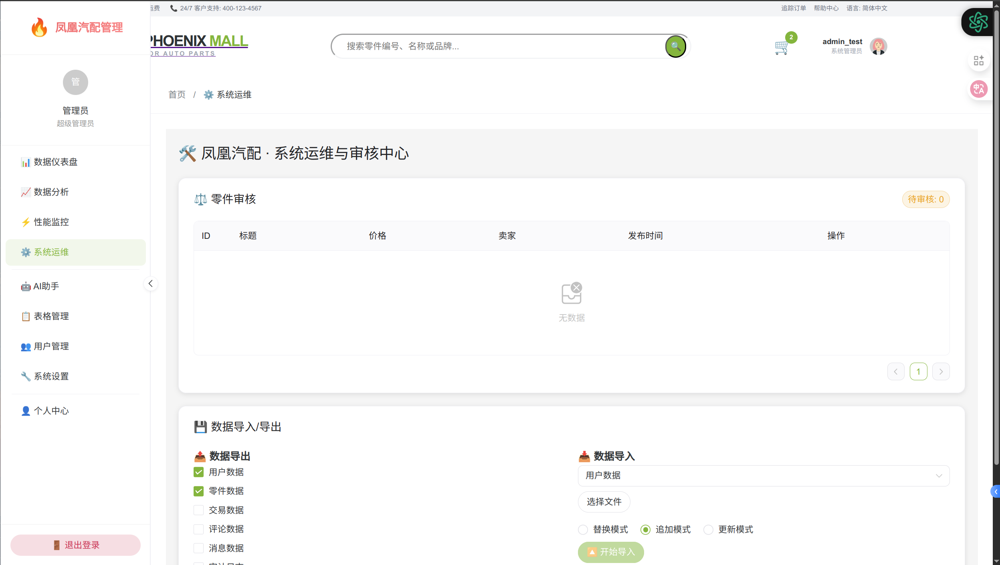

### 2.7 个人中心与 AI 助手 (Profile & AI)
用户个人信息管理与智能支持。

- **个人中心 (`ProfileCenterView.vue`)**：
  - **功能**：展示用户角色、登录历史、安全设置。
  - **集成**：内置 **AI 助手 (AIChatBox)**，支持零件咨询与系统引导。
- **图片参考**：
  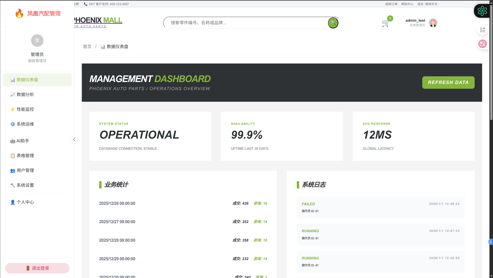
  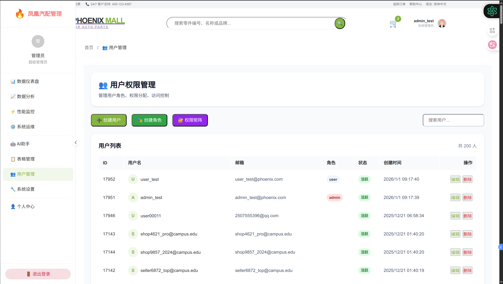

---

## 3. 管理后台界面 (Admin Portal)

### 3.1 业务仪表盘 (Dashboard)
实时监控系统运行状态与业务数据。

- **监控指标**：
  - 系统状态（Operational/Stable）。
  - 业务统计（成交量、咨询量趋势）。
  - 市场快照（最新发布零件）。
- **图片参考**：
  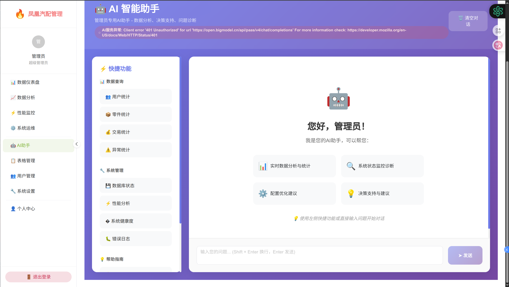

### 3.2 管理控制台 (Admin Console)
系统运维与风险控制中心。

- **功能**：
  - **快速操作**：清理缓存、数据备份。
  - **AI 实验室**：开启/关闭 AI 智能审核模式。
  - **风险概览**：高风险交易预警、流量监控。
- **图片参考**：
  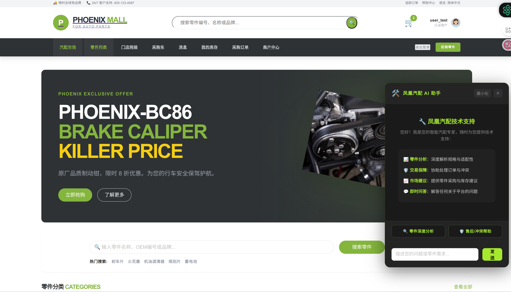

### 3.3 数据表管理 (Table Manager)
对系统 25 张核心数据表进行直接维护。

- **功能**：支持用户、零件、交易、审计日志等全量数据的增删改查。
- **图片参考**：
  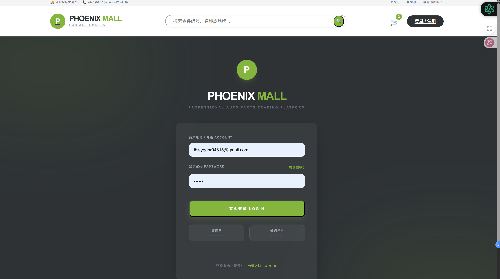

---

## 4. 典型交互组件说明

### 4.1 零件发布弹窗
- **交互流程**：点击“发布供应” -> 填写名称、分类、价格、成色 -> 上传图片（最多5张） -> 填写地点 -> 提交。
- **图片参考**：
  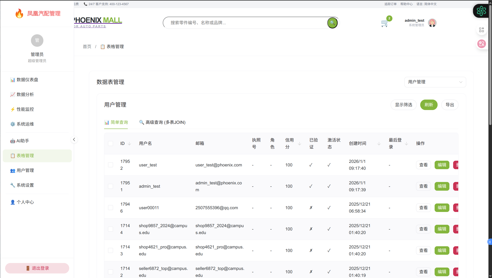

### 4.2 消息中心
- **功能**：基于 WebSocket 的实时聊天，支持零件卡片发送。
- **图片参考**：
  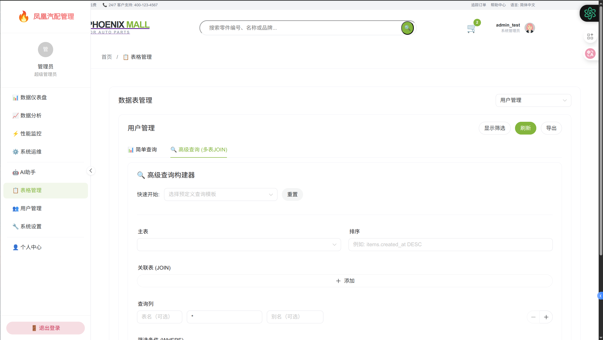

---

## 5. 界面设计总结
凤凰汽配管理系统的 UI 设计紧扣“专业、高效、智能”三大核心。通过 Naive UI 的深度定制与 Tailwind CSS 的灵活布局，确保了在处理复杂汽配数据时依然保持清晰的视觉层次。AI 助手的深度集成进一步降低了用户的操作门槛，提升了系统的整体智能化水平。

---
*注：以上界面截图均来源于系统真实运行环境。*
