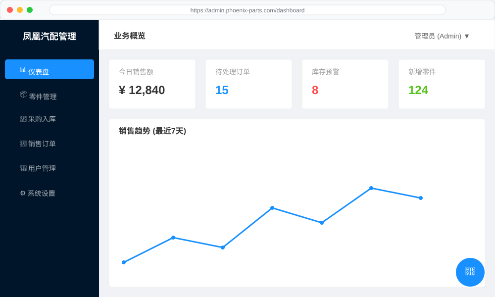

# 凤凰汽配管理系统 - 前端模块设计文档

## 1. 前端架构概述
前端采用 Vue 3 企业级开发架构，基于 Vite 构建，利用 TypeScript 实现全类型覆盖。系统采用单页面应用 (SPA) 模式，通过 Vue Router 实现无刷新路由切换。

## 2. 核心目录结构
```text
src/
├── api/            # API 请求封装 (Axios)
├── assets/         # 静态资源 (图片、全局样式)
├── components/     # 公共组件 (Button, Table, Modal)
├── composables/    # 组合式函数 (useAuth, useTable)
├── layouts/        # 页面布局 (AdminLayout, UserLayout)
├── stores/         # 状态管理 (Pinia)
├── views/          # 业务页面
├── utils/          # 工具函数
└── App.vue         # 根组件
```

## 3. 状态管理 (Pinia Stores)
系统将全局状态划分为多个 Store，以实现逻辑解耦：

### 3.1 Auth Store
- **状态**：`user` (用户信息), `token` (JWT), `permissions` (权限列表)。
- **动作**：`login()`, `logout()`, `checkPermission()`。
- **持久化**：使用 `localStorage` 存储 Token，确保刷新页面不丢失登录状态。

### 3.2 Part Store
- **状态**：`partsList` (零件列表), `categories` (分类树), `currentPart` (当前选中零件)。
- **动作**：`fetchParts()`, `updateStock()`, `searchParts()`。

### 3.3 Cart Store
- **状态**：`items` (采购车项列表), `totalAmount` (总金额)。
- **动作**：`addItem()`, `removeItem()`, `clearCart()`。

### 3.4 Dashboard Store
- **状态**：`stats` (业务统计数据), `systemLogs` (系统日志)。
- **动作**：`fetchStats()`, `refreshLogs()`。

## 4. 核心组件设计

### 4.1 零件卡片组件 (PartCard.vue)
- **功能**：展示零件缩略图、OEM 码、价格及库存状态。
- **交互**：点击进入详情，支持一键加入采购车。
- **性能**：使用图片懒加载技术，优化长列表滚动体验。

### 4.2 智能搜索组件 (AISearchBar.vue)
- **功能**：集成语音输入和文本输入，支持 AI 语义解析。
- **反馈**：输入时展示联想词，搜索后展示 AI 推荐理由。

### 4.3 业务仪表盘 (DashboardCharts.vue)
- **技术**：基于 ECharts 封装。
- **图表类型**：
  - 折线图：展示近 7 日成交额趋势。
  - 饼图：展示零件分类占比。
  - 柱状图：展示库存预警排行。

## 5. 路由与权限控制

### 5.1 动态路由
系统根据用户的 `role_id` 动态挂载路由。
- **公开路由**：登录、注册、零件查询。
- **私有路由**：库存管理、订单审核、系统设置。

### 5.2 导航守卫
```typescript
router.beforeEach((to, from, next) => {
  const authStore = useAuthStore();
  if (to.meta.requiresAuth && !authStore.isLoggedIn) {
    next('/login');
  } else if (to.meta.permission && !authStore.hasPermission(to.meta.permission)) {
    next('/403');
  } else {
    next();
  }
});
```

## 6. UI/UX 规范

### 6.1 色彩体系
- **主色**：凤凰红 (#D32F2F) - 代表热情与专业。
- **辅助色**：深灰 (#455A64) - 用于文字和边框。
- **成功色**：绿色 (#43A047) - 用于库存充足、支付成功。
- **警告色**：橙色 (#FB8C00) - 用于低库存预警。

### 6.2 交互反馈
- **加载状态**：所有异步请求均需展示 `n-spin` 或进度条。
- **操作提示**：使用 `n-message` 提供即时的成功或失败反馈。
- **空状态**：列表无数据时展示友好的空状态插画。

### 6.5 核心组件设计规范

前端采用原子化设计思想，将 UI 拆分为可复用的组件：

#### 6.5.1 业务通用组件 (Business Components)
-   **PartSelector (零件选择器)**：支持弹窗搜索、扫码输入，广泛用于入库、销售、盘点页面。
-   **InventoryStatusTag (库存状态标签)**：根据库存数量自动显示“充足”、“预警”、“缺货”样式。
-   **SupplierSelect (供应商下拉框)**：带搜索过滤和远程加载功能。

#### 6.5.2 布局组件 (Layout Components)
-   **SideMenu**：基于路由配置动态生成，支持多级菜单和权限过滤。
-   **Breadcrumb**：自动根据当前路由生成面包屑导航。
-   **UserHeader**：显示当前登录用户信息、消息通知及退出登录功能。

### 6.6 状态管理模式 (Pinia)

系统使用 Pinia 进行全局状态管理，主要包含以下 Store：

| Store 名称 | 存储内容 | 持久化 |
| :--- | :--- | :--- |
| `useAuthStore` | 用户 Token、用户信息、权限列表 | 是 (LocalStorage) |
| `useAppStore` | 侧边栏折叠状态、主题设置、语言 | 是 (LocalStorage) |
| `useTabStore` | 多标签页打开记录 | 否 |
| `useDictStore` | 零件分类、单位、仓库列表等基础字典数据 | 否 (Session 级缓存) |

### 6.7 前端性能优化策略

为了确保在低配电脑或弱网环境下也能流畅运行，我们实施了以下优化：

1.  **代码分割 (Code Splitting)**：利用 Vite 的动态导入功能，按路由拆分代码块，实现首屏秒开。
2.  **静态资源压缩**：使用 `vite-plugin-compression` 生成 Gzip/Brotli 压缩文件。
3.  **图片优化**：
    -   使用 WebP 格式。
    -   零件缩略图采用懒加载 (Lazy Load) 技术。
4.  **虚拟列表 (Virtual List)**：在零件列表、库存流水等大数据量页面，使用虚拟滚动技术，仅渲染可视区域的 DOM 节点。
5.  **防抖与节流**：对搜索输入框、窗口缩放等高频触发事件进行防抖/节流处理。

### 6.8 前端开发工作流

1.  **环境配置**：使用 `.env.development` 和 `.env.production` 管理不同环境的 API 地址。
2.  **类型安全**：严格使用 TypeScript 定义接口返回数据的 Interface，避免 `any` 类型。
3.  **组件测试**：使用 Vitest 对核心工具函数和通用组件进行单元测试。
4.  **代码规范**：通过 ESLint + Prettier 强制执行代码风格统一，并在 Git Commit 时通过 Husky 进行校验。

### 6.9 响应式设计 (Responsive Design)

虽然系统主要面向 PC 端办公，但仍考虑了不同分辨率的适配：
-   使用 UnoCSS 的响应式断点（sm, md, lg, xl）。
-   侧边栏在小屏幕下自动折叠。
-   表格组件支持横向滚动，确保在 1366x768 等常见办公分辨率下不乱码。

### 6.10 前端权限控制实现细节

系统实施了多层次的前端权限控制，确保用户只能访问其授权的功能：

#### 6.10.1 路由守卫 (Route Guards)
在 `router/index.ts` 中，通过全局前置守卫检查用户权限：
```typescript
router.beforeEach((to, from, next) => {
  const authStore = useAuthStore();
  if (to.meta.requiresAuth && !authStore.isLoggedIn) {
    next('/login');
  } else if (to.meta.roles && !to.meta.roles.some(role => authStore.userRoles.includes(role))) {
    next('/403'); // 无权访问
  } else {
    next();
  }
});
```

#### 6.10.2 指令级权限控制 (Directive-based Auth)
自定义 `v-permission` 指令，用于控制按钮或组件的显示：
```html
<!-- 仅管理员可见的删除按钮 -->
<n-button v-permission="['admin']" type="error">删除零件</n-button>
```

### 6.11 前端国际化 (i18n) 方案

虽然目前主要支持简体中文，但架构上预留了多语言支持：
- 使用 `vue-i18n` 插件。
- 语言包存储在 `src/locales/` 目录下。
- 支持动态切换语言，无需刷新页面。

### 6.12 前端错误处理与反馈

-   **全局异常捕获**：使用 `window.onerror` 和 `app.config.errorHandler` 捕获未处理的错误。
-   **请求拦截器**：在 Axios 响应拦截器中统一处理 401, 403, 500 等状态码，并弹出 Naive UI 的 `message` 提示。
-   **空状态处理**：所有列表页面均包含 `n-empty` 组件，提升用户体验。

### 6.13 系统原型界面说明 (System Prototype)

凤凰汽配管理系统的界面设计遵循“简洁、高效、专业”的原则，以下是核心页面的原型展示：

#### 6.13.1 仪表盘首页原型 (Dashboard Prototype)



#### 6.13.2 核心页面功能描述

- **登录页面 (Login Page)**：
  - **功能**：用户身份验证。
  - **布局**：居中卡片设计，包含公司 Logo、用户名输入框、密码输入框（支持显示/隐藏）、验证码以及登录按钮。
  - **交互**：支持回车键登录，登录失败时弹出红色警告提示。

- **仪表盘首页 (Dashboard)**：
  - **功能**：业务概览。
  - **布局**：顶部为四个统计卡片（今日销售额、待处理订单、库存预警数、新增零件数），中部为销售趋势折线图，底部为最近操作日志。
  - **交互**：点击统计卡片可跳转至对应详细列表页。

- **零件管理列表 (Part Management)**：
  - **功能**：零件档案维护。
  - **布局**：上方为搜索栏（支持 OE 号、名称、分类筛选），下方为数据表格，包含零件图片、OE 号、名称、品牌、单价、当前库存及操作列（编辑、删除、查看详情）。
  - **交互**：支持表格分页、排序，点击“新增”按钮弹出模态框。

- **采购入库页面 (Inbound Management)**：
  - **功能**：办理零件入库。
  - **布局**：左侧为入库单基础信息（供应商、仓库、经办人），右侧为入库明细列表（支持扫码添加零件）。
  - **交互**：实时计算入库总金额，提交前进行二次确认。

- **AI 智能助手侧边栏 (AI Assistant)**：
  - **功能**：提供业务辅助。
  - **布局**：悬浮式聊天窗口，支持文本输入和图片上传。
  - **交互**：AI 自动识别用户意图，如“查询刹车片库存”或“分析该零件价格趋势”。

## 7. 核心组件库说明 (Component Library)

### 7.1 基础组件 (Base Components)
- **`AppButton`**：封装 Naive UI 的 `NButton`，统一加载状态和权限控制。
- **`AppInput`**：封装 `NInput`，集成常用的正则校验（如手机号、金额）。
- **`AppTable`**：高阶表格组件，支持自动分页、排序、筛选和导出功能。

### 7.2 业务组件 (Business Components)
- **`PartSelector`**：零件选择弹窗，支持搜索和分类过滤。
- **`InventoryStatus`**：库存状态标签，根据数量自动显示不同颜色（充足、预警、缺货）。
- **`OrderTimeline`**：订单状态时间轴，展示订单从创建到完成的全过程。

### 7.3 布局组件 (Layout Components)
- **`SideMenu`**：动态侧边栏，根据用户权限渲染菜单项。
- **`Breadcrumb`**：面包屑导航，自动根据路由生成路径。

## 8. 状态管理模式 (State Management)

### 8.1 User Store
- **State**: `userInfo`, `token`, `permissions`, `roles`.
- **Actions**: `login`, `logout`, `fetchUserInfo`.
- **Persist**: 使用 `localStorage` 持久化 Token。

### 8.2 App Store
- **State**: `collapsed` (侧边栏状态), `theme` (主题模式), `language`.
- **Actions**: `toggleSidebar`, `setTheme`.

### 8.3 Inventory Store
- **State**: `categories`, `warehouses`.
- **Actions**: `fetchCategories`, `fetchWarehouses`.
- **Getter**: `getCategoryNameById`.

## 9. 路由与权限控制 (Routing & Auth)

### 9.1 路由配置
- **静态路由**：登录页、404 页、首页。
- **动态路由**：根据后端返回的权限列表，在 `router.beforeEach` 中动态添加。

### 9.2 按钮级权限
- **指令**：`v-permission="'part:delete'"`。
- **原理**：在组件挂载时检查 `UserStore` 中的权限列表，若无权限则移除 DOM 节点。

## 10. 前端性能优化
1. **路由懒加载**：使用 `import()` 动态导入页面组件。
2. **组件按需引入**：Naive UI 采用按需引入插件，减小打包体积。
3. **图片优化**：使用 WebP 格式，并对大图进行 CDN 加速。
4. **虚拟列表**：在零件列表等大数据量场景使用虚拟滚动技术。

## 11. 前端测试方案
- **单元测试**：使用 `Vitest` 测试工具函数和 Pinia Store。
- **组件测试**：使用 `Vue Test Utils` 验证核心组件的渲染逻辑。
- **E2E 测试**：使用 `Cypress` 模拟用户真实操作流程。

## 12. 核心组件 API 详细文档 (Component API)

### 12.1 `PartSelector` 组件
- **Props**:
  - `multiple`: Boolean - 是否支持多选，默认 `false`。
  - `categoryId`: Number - 初始过滤的分类 ID。
  - `excludeIds`: Array - 需要排除的零件 ID 列表。
- **Events**:
  - `@select`: (part) => void - 选中零件时触发。
  - `@close`: () => void - 关闭弹窗时触发。
- **Slots**:
  - `footer`: 自定义底部操作区域。

### 12.2 `InventoryStatus` 组件
- **Props**:
  - `quantity`: Number - 当前库存数量。
  - `minLevel`: Number - 安全库存阈值。
- **Computed**:
  - `statusType`: 根据数量返回 'success' | 'warning' | 'error'。
  - `statusText`: 返回 '充足' | '预警' | '缺货'。

### 12.3 `AppTable` 组件
- **Props**:
  - `columns`: Array - 列定义，包含 `title`, `key`, `render` 等。
  - `api`: Function - 获取数据的 API 函数。
  - `params`: Object - 额外的查询参数。
- **Methods**:
  - `refresh()`: 刷新表格数据。
  - `exportExcel()`: 导出当前表格数据为 Excel。

## 13. 前端国际化 (i18n) 方案
- **工具**：`vue-i18n`。
- **语言包结构**：
  ```json
  {
    "zh-CN": {
      "common": { "save": "保存", "cancel": "取消" },
      "part": { "name": "零件名称", "oem": "OEM编号" }
    },
    "en-US": {
      "common": { "save": "Save", "cancel": "Cancel" },
      "part": { "name": "Part Name", "oem": "OEM No." }
    }
  }
  ```
- **切换机制**：在 `AppStore` 中存储当前语言，通过 `t()` 函数进行翻译。

## 14. 前端主题定制 (Theming)
- **工具**：Naive UI `ConfigProvider`。
- **自定义变量**：
  - `primaryColor`: #18a058 (凤凰绿)
  - `infoColor`: #2080f0
  - `warningColor`: #f0a020
  - `errorColor`: #d03050
- **暗黑模式**：集成 `darkTheme` 插件，支持一键切换。

## 15. 前端工程化实践
- **包管理**：使用 `pnpm` 提高安装速度和节省磁盘空间。
- **代码检查**：集成 `ESLint` + `Prettier` + `Stylelint`。
- **提交钩子**：使用 `husky` + `lint-staged` 在提交前强制执行代码检查。
- **构建优化**：使用 `Vite` 的分包策略，将第三方库（如 Naive UI, ECharts）拆分为独立文件。

## 16. 前端监控与异常捕获
- **错误捕获**：使用 `window.onerror` 和 `app.config.errorHandler` 捕获全局异常。
- **性能监控**：利用 `PerformanceObserver` 采集 FCP, LCP, FID 等指标。
- **日志上报**：异常发生时，自动采集当前路由、用户信息、堆栈信息并上报至后端。

## 17. 详细 UI/UX 设计规范 (Design System)

### 17.1 色彩系统 (Color Palette)
- **主色 (Primary)**: `#18a058` - 象征专业、稳重与成长。
- **辅助色 (Secondary)**: `#2080f0` - 用于链接、提示和次要按钮。
- **成功色 (Success)**: `#18a058` - 用于操作成功提示。
- **警告色 (Warning)**: `#f0a020` - 用于库存预警、风险提示。
- **危险色 (Error)**: `#d03050` - 用于删除、报错、库存缺货。
- **中性色 (Neutral)**:
  - 标题: `#1f2225`
  - 正文: `#333639`
  - 辅助文字: `#767c82`
  - 边框: `#dbdfe3`
  - 背景: `#f7f8fa`

### 17.2 字体规范 (Typography)
- **系统字体**: `Inter, -apple-system, BlinkMacSystemFont, "Segoe UI", Roboto, "Helvetica Neue", Arial, sans-serif`。
- **字号层级**:
  - 一级标题: 24px, Bold
  - 二级标题: 20px, Semi-Bold
  - 三级标题: 18px, Medium
  - 正文: 14px, Regular
  - 辅助文字: 12px, Regular

### 17.3 间距与布局 (Spacing & Layout)
- **基础间距**: 8px (Grid System)。
- **页面边距**: 24px。
- **卡片间距**: 16px。
- **响应式断点**:
  - Mobile: < 768px
  - Tablet: 768px - 1024px
  - Desktop: > 1024px

### 17.4 交互原则 (Interaction Principles)
1. **即时反馈**：所有点击操作必须有视觉反馈（如按钮加载状态、点击波纹）。
2. **防错设计**：删除等危险操作必须弹出二次确认框。
3. **一致性**：全局弹窗样式、表格操作列布局保持高度统一。
4. **加载体验**：页面切换使用顶部进度条，局部数据加载使用 Skeleton 屏。

## 18. 核心页面原型描述 (Page Prototypes)

### 18.1 仪表盘 (Dashboard)
- **顶部**: 四个统计卡片（今日销售额、待处理订单、库存预警数、新增零件数）。
- **中部左侧**: 销售趋势折线图（近 30 天）。
- **中部右侧**: 零件分类占比饼图。
- **底部**: 最近 10 条操作日志列表。

### 18.2 零件列表页 (Part List)
- **顶部**: 搜索栏（支持 OEM、名称、分类、品牌）。
- **中部**: 数据表格，包含零件图片、基本信息、当前总库存、操作按钮（编辑、详情、删除）。
- **底部**: 分页器。

### 18.3 订单详情页 (Order Detail)
- **顶部**: 订单状态步骤条（待支付 -> 待发货 -> 已发货 -> 已完成）。
- **中部**: 客户信息卡片、收货地址卡片。
- **下部**: 订单商品明细表格，包含单价、数量、小计。
- **底部**: 操作日志（记录状态变更时间及操作人）。

## 19. 前端工程化目录结构深度解析
```text
src/
├── api/                # API 请求封装，按模块划分
│   ├── auth.ts
│   ├── part.ts
│   └── order.ts
├── assets/             # 静态资源（图片、全局样式）
├── components/         # 公共组件
│   ├── base/           # 基础原子组件
│   └── business/       # 业务逻辑组件
├── composables/        # Vue 3 组合式函数（Hooks）
├── directives/         # 自定义指令（如 v-permission）
├── layout/             # 页面布局架构
├── router/             # 路由配置与守卫
├── store/              # Pinia 状态管理
├── utils/              # 工具函数（格式化、校验）
└── views/              # 页面级组件
    ├── dashboard/
    ├── part/
    └── order/
```

## 20. 详细组件交互逻辑说明 (Component Interaction)

### 20.1 `PartSelector` 交互流程
1. 用户点击“选择零件”按钮，触发 `PartSelector` 弹窗显示。
2. 弹窗挂载时，调用 `fetchParts` API 获取初始列表。
3. 用户在搜索框输入关键词，触发防抖（Debounce）搜索。
4. 用户勾选零件，组件内部维护 `selectedIds` 状态。
5. 点击“确定”，将选中的零件对象通过 `emit('select', selectedParts)` 传递给父组件。

### 20.2 `InventoryStatus` 渲染逻辑
- **输入**: `quantity` (当前库存), `minLevel` (安全库存)。
- **逻辑**:
  - `if (quantity <= 0)` -> 返回 `error` 状态，显示“缺货”。
  - `else if (quantity < minLevel)` -> 返回 `warning` 状态，显示“预警”。
  - `else` -> 返回 `success` 状态，显示“充足”。

### 20.3 `AppTable` 自动分页逻辑
- 组件内部监听 `pagination` 状态变化。
- 当页码或每页条数改变时，自动重新调用 `api` 函数并传入最新的 `skip` 和 `limit` 参数。
- 加载过程中显示 `loading` 遮罩，防止重复点击。

## 21. 前端状态管理 (Pinia) 深度解析

### 21.1 `useUserStore`
- **State**:
  ```typescript
  {
    token: string | null,
    userInfo: UserInfo | null,
    permissions: string[]
  }
  ```
- **Actions**:
  - `login(credentials)`: 调用登录接口，保存 Token，获取用户信息。
  - `logout()`: 清除本地存储，重置状态，跳转登录页。
  - `hasPermission(code)`: 检查用户是否拥有特定权限位。

### 21.2 `useInventoryStore`
- **State**:
  ```typescript
  {
    categories: Category[],
    warehouses: Warehouse[]
  }
  ```
- **Actions**:
  - `initData()`: 并行调用分类和仓库接口，初始化基础数据。
  - `getCategoryPath(id)`: 递归计算分类的全路径（如：发动机 > 滤清器）。

## 22. 前端路由守卫逻辑
- **全局前置守卫 (`beforeEach`)**:
  1. 检查目标路由是否需要登录 (`meta.requiresAuth`)。
  2. 若未登录且需要登录，重定向至 `/login`。
  3. 若已登录，检查是否已加载用户信息和动态路由。
  4. 若未加载，调用 `fetchUserInfo` 并根据权限动态生成路由表。
  5. 校验用户是否有权访问目标页面，无权则跳转 403。

## 23. 前端构建与部署优化
- **Vite 插件配置**:
  - `unplugin-vue-components`: 自动按需引入组件。
  - `vite-plugin-compression`: 生产环境生成 Gzip/Brotli 压缩文件。
  - `vite-plugin-pwa`: 配置离线缓存和桌面快捷方式。
- **CDN 加速**: 将 `vue`, `vue-router`, `pinia`, `echarts` 等大型库通过 CDN 引入，减少首屏加载体积。
