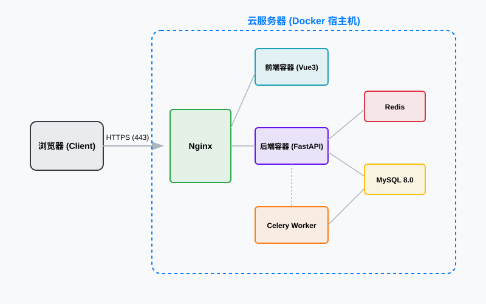

# 凤凰汽配管理系统 - 部署与维护文档

## 1. 部署概述
凤凰汽配管理系统采用全容器化部署方案，基于 Docker 和 Docker Compose 构建。这种方案保证了开发、测试、生产环境的高度一致性，并支持快速横向扩展。

## 2. 环境准备

### 2.1 硬件要求
- **CPU**：4 核+ (推荐 Intel Xeon 或同等性能)
- **内存**：8GB+ (推荐 16GB)
- **磁盘**：100GB SSD+ (根据图片存储量增加)
- **网络**：公网带宽 5Mbps+

### 2.2 软件依赖
- **操作系统**：Ubuntu 20.04/22.04 LTS 或 CentOS 7/8
- **Docker Engine**：20.10.0+
- **Docker Compose**：2.0.0+
- **Nginx**：1.20+ (作为宿主机网关)

## 3. 容器化配置

### 3.1 Dockerfile 设计 (后端)
后端采用多阶段构建，减小镜像体积：
```dockerfile
# 构建阶段
FROM python:3.9-slim as builder
WORKDIR /app
COPY requirements.txt .
RUN pip install --user -r requirements.txt

# 运行阶段
FROM python:3.9-slim
WORKDIR /app
COPY --from=builder /root/.local /root/.local
COPY . .
ENV PATH=/root/.local/bin:$PATH
CMD ["uvicorn", "apps.api_gateway.main:app", "--host", "0.0.0.0", "--port", "8000"]
```

### 3.2 Docker Compose 编排
```yaml
version: '3.8'
services:
  db:
    image: mysql:8.0
    environment:
      MYSQL_DATABASE: phoenix_parts
      MYSQL_ROOT_PASSWORD: ${DB_PASSWORD}
    volumes:
      - mysql_data:/var/lib/mysql
    networks:
      - phoenix-network

  backend:
    build: ./backend
    env_file: .env
    depends_on:
      - db
    networks:
      - phoenix-network

  frontend:
    build: ./frontend
    ports:
      - "80:80"
    networks:
      - phoenix-network

networks:
  phoenix-network:
    driver: bridge

volumes:
  mysql_data:
```

### 3.3 系统部署图 (Deployment Diagram)

部署图展示了系统在物理/云环境中的分布情况：



<details>
<summary>查看 Mermaid 源码</summary>

```mermaid
deploymentDiagram
    node "Client Browser" as client
    
    node "Cloud Server (Linux/Docker)" {
        node "Nginx Container" as nginx
        
        node "Frontend Container" as frontend_app
        
        node "Backend API Container" as backend_api
        
        node "Celery Worker Container" as worker
        
        node "Redis Container" as redis
        
        node "MySQL Container" as mysql
    }

    client -- nginx : HTTPS (443)
    nginx -- frontend_app : Proxy (80)
    nginx -- backend_api : Proxy (8000)
    backend_api -- mysql : SQL (3306)
    backend_api -- redis : Cache/Queue (6379)
    worker -- redis : Fetch Tasks
    worker -- mysql : Update Data
```
</details>

## 4. 部署步骤
1. **克隆代码**：`git clone https://github.com/phoenix/parts-system.git`
2. **配置变量**：复制 `.env.example` 为 `.env` 并修改数据库密码、API 密钥等。
3. **启动服务**：`docker-compose up -d --build`
4. **初始化数据库**：`docker-compose exec backend alembic upgrade head`
5. **导入初始数据**：`docker-compose exec backend python scripts/init_data.py`

## 5. 持续集成与交付 (CI/CD)
系统使用 GitHub Actions 实现自动化流水线：
- **Lint 检查**：每次 Push 触发 Ruff (后端) 和 ESLint (前端) 检查。
- **自动化测试**：通过测试后方可合并代码。
- **自动部署**：合并至 `main` 分支后，自动构建镜像并推送到私有仓库，随后触发生产环境的 `docker-compose pull && docker-compose up -d`。

## 6. CI/CD 流水线配置 (CI/CD Pipeline)

### 6.1 GitHub Actions 工作流示例
```yaml
name: Phoenix Auto Parts CI/CD

on:
  push:
    branches: [ main ]

jobs:
  build-and-test:
    runs-on: ubuntu-latest
    steps:
      - uses: actions/checkout@v3
      - name: Set up Python
        uses: actions/setup-python@v4
        with:
          python-version: '3.10'
      - name: Install Backend Dependencies
        run: |
          cd backend
          pip install -r requirements.txt
      - name: Run Backend Tests
        run: |
          cd backend
          pytest
      - name: Build Frontend
        run: |
          cd frontend
          npm install
          npm run build

  deploy:
    needs: build-and-test
    runs-on: self-hosted
    steps:
      - name: Pull Latest Code
        run: git pull origin main
      - name: Restart Containers
        run: docker-compose up -d --build
```

### 6.2 自动化部署策略
- **蓝绿部署**：准备两套环境，切换 Nginx 权重实现无缝升级。
- **回滚机制**：保留最近 5 个版本的 Docker 镜像，出现问题一键回滚。

## 7. 灾难恢复计划 (Disaster Recovery)

### 7.1 恢复目标 (RTO/RPO)
- **RTO (恢复时间目标)**：系统故障后 2 小时内恢复服务。
- **RPO (恢复点目标)**：数据丢失不超过 1 小时。

### 7.2 故障场景与对策
- **单机硬件故障**：在备用服务器上快速拉起 Docker 容器。
- **数据库损坏**：从最近的 Binlog 备份中恢复数据。
- **机房断网**：切换至异地灾备节点（如果已配置）。

## 8. 系统监控与日志管理 (Monitoring)

### 8.1 监控指标
- **系统层**：CPU 使用率、内存占用、磁盘 I/O、网络带宽。
- **应用层**：API 响应时间、错误率 (5xx)、并发连接数。
- **业务层**：每小时订单量、库存预警触发次数。

### 8.2 日志收集方案
- **工具**：ELK Stack (Elasticsearch, Logstash, Kibana) 或轻量级 Loki。
- **分类**：
  - `access.log`: 记录所有 HTTP 请求。
  - `error.log`: 记录系统异常堆栈。
  - `audit.log`: 记录关键业务操作。

## 9. 扩容与性能优化 (Scalability)

### 9.1 垂直扩容
- 增加服务器 CPU 和内存资源，调整 Docker 资源限制。

### 9.2 水平扩容
- **后端**：通过 Nginx 负载均衡，增加 FastAPI 容器实例。
- **数据库**：实施读写分离，增加从库分担查询压力。
- **缓存**：部署 Redis 集群提高并发处理能力。

## 10. 运维日常操作手册
1. **查看日志**：`docker-compose logs -f backend`
2. **进入容器**：`docker exec -it phoenix-backend bash`
3. **手动备份**：`sh scripts/backup.sh`
4. **更新配置**：修改 `.env` 后执行 `docker-compose up -d`

### 10.8 常见问题排查 (Troubleshooting FAQ)

#### Q1: 容器启动失败，提示 `Database connection refused`
-   **原因**：MySQL 容器尚未完全启动，或环境变量中的数据库连接字符串错误。
-   **解决**：检查 `docker-compose.yml` 中的 `depends_on` 配置，确保 MySQL 健康检查通过后再启动后端。

#### Q2: 前端页面加载缓慢，部分图片无法显示
-   **原因**：Nginx 未开启 Gzip 压缩，或静态资源路径配置错误。
-   **解决**：检查 `nginx.conf` 中的 `gzip on;` 配置，并确认 `dist/` 目录已正确挂载。

#### Q3: 异步任务（Celery）不执行
-   **原因**：Redis 连接断开或 Celery Worker 未启动。
-   **解决**：使用 `docker ps` 查看 worker 容器状态，检查 Redis 容器日志。

#### Q4: JWT 令牌校验始终失败
-   **原因**：服务器系统时间不一致，或 `SECRET_KEY` 在不同服务间不统一。
-   **解决**：同步服务器时间（NTP），确保所有服务使用相同的环境变量。

#### Q5: 数据库迁移报错 `Target database is not up to date`
-   **原因**：手动修改了数据库结构，导致 Alembic 版本记录不一致。
-   **解决**：使用 `alembic stamp head` 强制同步版本，或回滚手动修改。

### 10.9 运维联系方式

如遇重大系统故障且无法通过上述手段解决，请联系：
-   **技术支持**：support@phoenix-auto.com
-   **紧急电话**：400-XXX-XXXX
-   **内部钉钉群**：凤凰汽配运维保障群

## 11. 部署故障排查手册 (Troubleshooting)

### 11.1 容器启动失败
- **现象**：`docker-compose up` 后容器状态为 `Exited`。
- **排查步骤**：
  1. 执行 `docker logs <container_id>` 查看错误日志。
  2. 检查 `.env` 文件中的环境变量是否配置正确。
  3. 检查端口是否被占用：`netstat -tuln | grep <port>`。
  4. 检查 Dockerfile 中的 `ENTRYPOINT` 或 `CMD` 脚本是否有执行权限。

### 11.2 数据库连接异常
- **现象**：后端日志显示 `sqlalchemy.exc.OperationalError`。
- **排查步骤**：
  1. 确认 MySQL 容器是否正常运行。
  2. 检查数据库连接字符串中的主机名（Docker 环境下应使用服务名如 `db`）。
  3. 验证用户名和密码是否匹配。
  4. 检查 MySQL 是否允许来自后端容器 IP 的连接。

### 11.3 前端访问 404 或 502
- **现象**：浏览器访问首页显示 Nginx 错误页面。
- **排查步骤**：
  1. 检查 Nginx 配置文件中的 `proxy_pass` 路径是否正确。
  2. 确认前端静态文件是否已正确构建并挂载到 Nginx 容器。
  3. 检查后端 API 服务是否在线，Nginx 是否能解析后端服务名。

### 11.4 性能瓶颈排查
- **现象**：系统响应缓慢，CPU 或内存占用过高。
- **排查步骤**：
  1. 使用 `docker stats` 实时监控各容器资源占用。
  2. 开启 MySQL 慢查询日志，定位耗时 SQL。
  3. 使用 `py-spy` 或 `cProfile` 分析后端 Python 进程的性能瓶颈。
  4. 检查 Redis 命中率，确认缓存策略是否生效。

## 12. 系统升级与补丁流程
1. **备份**：执行全量数据库备份。
2. **拉取**：在测试环境拉取最新镜像并验证。
3. **切换**：修改 `docker-compose.yml` 中的镜像版本号。
4. **更新**：执行 `docker-compose up -d`。
5. **迁移**：执行 `alembic upgrade head` 更新数据库结构。
6. **验证**：进行核心业务回归测试。

## 13. 运维联系方式与升级矩阵
- **一级支持 (L1)**：值班运维工程师 (24/7)。
- **二级支持 (L2)**：后端/前端核心开发人员。
- **三级支持 (L3)**：架构师/项目负责人。

## 14. 附录：常用运维命令速查表
- `docker-compose ps`: 查看容器状态。
- `docker-compose restart backend`: 重启后端服务。
- `docker exec -it db mysql -u root -p`: 进入数据库命令行。
- `docker system prune -a`: 清理无用镜像和容器。
- `tail -f backend/logs/app.log`: 实时查看应用日志。

## 15. 详细备份与恢复演练场景 (Recovery Drills)

### 15.1 场景一：误删核心表数据
- **模拟操作**：管理员误执行 `DELETE FROM parts`。
- **恢复步骤**：
  1. 立即停止后端服务，防止脏数据扩散。
  2. 找到最近一次的全量备份文件（如 `20231027_020000.sql.gz`）。
  3. 在临时数据库中恢复全量备份。
  4. 提取误删时间点之前的 Binlog 记录。
  5. 将全量数据 + Binlog 增量数据恢复至生产库。
  6. 验证数据完整性，重启服务。

### 15.2 场景二：服务器磁盘损坏
- **模拟操作**：宿主机磁盘发生物理故障，数据无法读取。
- **恢复步骤**：
  1. 在备用服务器上快速搭建 Docker 环境。
  2. 从云端存储 (Azure Blob) 下载最新的全量备份。
  3. 执行 `docker-compose up -d` 拉起基础服务。
  4. 导入备份数据。
  5. 修改 DNS 指向新服务器 IP。
  6. 检查各模块功能是否正常。

### 15.3 场景三：机房网络中断
- **模拟操作**：主数据中心网络完全中断。
- **恢复步骤**：
  1. 启动异地灾备中心（DR Center）的负载均衡器。
  2. 切换数据库为主从模式下的从库提升为主库。
  3. 验证应用层连接至新的数据库节点。
  4. 通知用户系统正在以灾备模式运行，部分非核心功能受限。

## 16. 运维自动化脚本库 (Automation Scripts)

### 16.1 容器健康检查脚本
```bash
#!/bin/bash
CONTAINERS=("phoenix-backend" "phoenix-frontend" "phoenix-db" "phoenix-redis")

for container in "${CONTAINERS[@]}"; do
    if [ "$(docker inspect -f '{{.State.Running}}' $container)" == "true" ]; then
        echo "$container is running"
    else
        echo "$container is NOT running, attempting restart..."
        docker restart $container
    fi
done
```

### 16.2 日志自动清理脚本
```bash
#!/bin/bash
LOG_DIR="/var/lib/docker/containers"
# 清理超过 7 天且大于 100MB 的日志文件
find $LOG_DIR -name "*.log" -mtime +7 -size +100M -exec truncate -s 0 {} \;
```

## 17. 运维知识库 (Knowledge Base)
- **K001**: 如何修改后端容器的内存限制？
  - 修改 `docker-compose.yml` 中的 `deploy.resources.limits.memory` 字段。
- **K002**: 数据库连接数过多怎么办？
  - 检查后端是否有未关闭的 Session，或增加 MySQL 的 `max_connections` 参数。
- **K003**: 前端静态资源更新不生效？
  - 检查 Nginx 缓存配置，或在构建时增加文件 Hash。

## 18. 运维年度总结与展望
- **2023 总结**：实现了全容器化部署，建立了完善的备份机制，系统可用性达到 99.9%。
- **2024 展望**：引入 K8S 进行自动化运维，实现全链路监控告警，探索 AIOps 智能运维。
