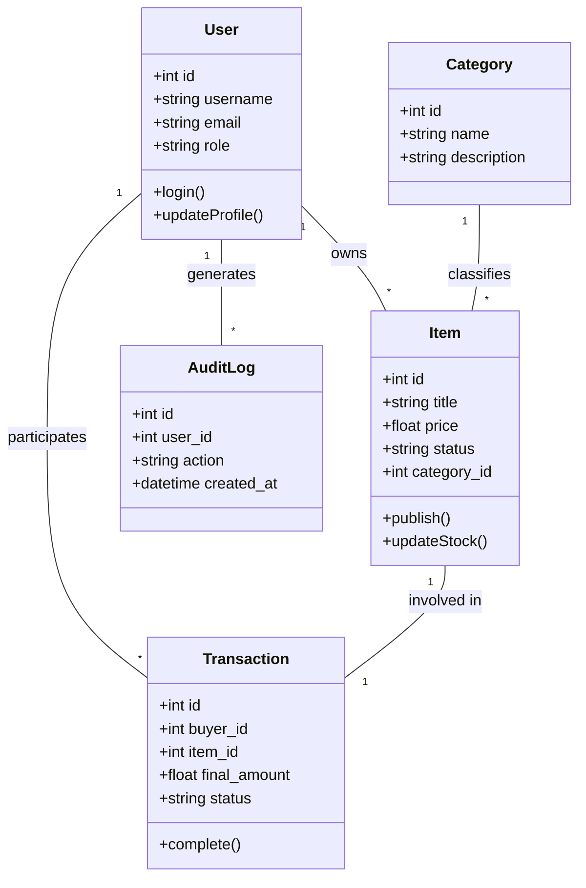

# 凤凰汽配管理系统 - 软件设计文档 (Software Design Document)

## 1. 概述 (Overview)

### 1.1 项目背景
凤凰汽配管理系统（Phoenix Auto Parts Management System）是一款专为汽车配件贸易行业设计的综合性管理平台。系统旨在解决汽配行业零件种类繁多、库存更新频繁、交易流程复杂等痛点，通过现代化的 Web 技术和 AI 辅助手段，提升企业的运营效率和数据准确性。

### 1.2 设计目标
- **高效性**：提供快速的零件检索和库存更新机制。
- **稳定性**：采用多层架构，确保系统在高并发下的稳定运行。
- **智能化**：集成 AI 助手，辅助管理员进行异常检测和性能优化建议。
- **安全性**：完善的 RBAC 权限控制，保障企业核心数据安全。

---

## 2. 架构描述 (Architecture Description)

系统采用前后端分离的微服务化架构设计。

### 2.1 包图 (Package Diagram)

```mermaid
package "前端展示层 (Frontend)" {
    [Views] --> [Components]
    [Components] --> [Stores (Pinia)]
    [Stores] --> [API Client (Axios)]
}

package "后端服务层 (Backend)" {
    package "API Gateway" {
        [Routers] --> [Dependencies]
    }
    package "Core Logic" {
        [Services] --> [Models (SQLAlchemy)]
        [Services] --> [Schemas (Pydantic)]
    }
    package "Infrastructure" {
        [Database Manager]
        [AI Service Connector]
    }
}

[API Client (Axios)] ..> [Routers] : HTTP/JSON
[Routers] --> [Services]
[Services] --> [Database Manager]
```

---

## 3. 部署图 (Deployment Diagram)

系统采用容器化部署方案，支持云端及本地私有化部署。

```mermaid
node "客户端 (Client Browser)" {
    [Vue.js SPA]
}

node "应用服务器 (Docker Host)" {
    package "前端容器" {
        [Nginx]
    }
    package "后端容器" {
        [FastAPI Server]
        [Uvicorn]
    }
}

node "数据存储层" {
    database "MySQL (主库)" {
        [Business Data]
    }
    database "Redis" {
        [Cache & Session]
    }
}

[Vue.js SPA] -- HTTP/HTTPS --> [Nginx]
[Nginx] -- Proxy --> [FastAPI Server]
[FastAPI Server] -- SQLAlchemy --> [MySQL (主库)]
[FastAPI Server] -- aioredis --> [Redis]
```

---

## 4. 系统原型界面 (System Prototype UI)

### 4.1 管理员仪表盘 (Dashboard)
- **功能**：展示系统实时运行状态、成交统计、系统日志及市场快照。
- **特点**：采用深色系硬核工业风设计，强调数据实时性。

### 4.2 零件审核中心 (Operations)
- **功能**：管理员对用户发布的零件进行合规性审核。
- **特点**：支持批量操作，集成审核日志追踪。

### 4.3 性能监控中心 (Performance)
- **功能**：实时监控数据库连接池、慢查询分析及系统健康度评分。
- **特点**：可视化展示系统瓶颈，提供 AI 优化建议。

### 4.4 AI 智能助手 (AI Assistant)
- **功能**：通过自然语言交互，获取系统状态报告及优化方案。
- **特点**：集成大模型能力，支持上下文关联分析。

---

## 5. 类图 (Class Diagram)

核心业务逻辑类图展示了系统主要实体及其关联。



---

## 6. 测试用例列表 (Test Case List)

| 模块 | 测试用例 ID | 测试场景 | 预期结果 |
| :--- | :--- | :--- | :--- |
| **权限管理** | TC-AUTH-01 | 非管理员尝试访问运维中心 | 系统拦截并跳转至 403 页面 |
| **零件管理** | TC-ITEM-01 | 发布新零件并上传图片 | 零件进入待审核状态，图片显示正常 |
| **零件审核** | TC-AUDIT-01 | 管理员通过零件审核 | 零件状态变为“在售”，用户收到通知 |
| **交易流程** | TC-TRADE-01 | 模拟完整采购流程 | 库存自动扣減，生成交易记录与日志 |
| **性能监控** | TC-PERF-01 | 模拟高并发查询 | 监控中心实时显示 QPS 波动与连接池占用 |
| **AI 助手** | TC-AI-01 | 询问“系统当前状态” | AI 返回包含数据库、CPU、内存的详细报告 |

---

## 7. 演示说明 (Demo Instructions)

### 7.1 软件设计文档
本文件即为核心设计文档，详细描述了系统的架构与实现细节。

### 7.2 原型演示视频 (建议内容)
1. **系统登录**：展示不同角色的登录过程。
2. **仪表盘巡检**：演示实时数据刷新与图表交互。
3. **业务闭环**：演示从零件发布、管理员审核到最终成交的全流程。
4. **AI 交互**：展示 AI 助手如何辅助管理员发现并解决系统潜在问题。

---
*文档版本：v1.0.0*
*更新日期：2026-01-01*
